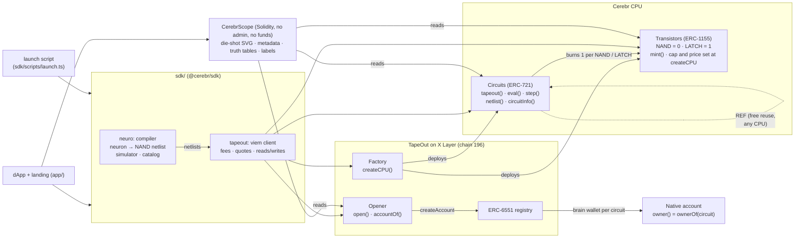

# Cerebr

**A neural processor, taped out on X Layer.**

Cerebr is a processor created through the [TapeOut](https://tapeout.net) factory on X Layer mainnet, together with a compiler that turns neurons into real NAND netlists. We tape those neurons out as circuits on our own processor. Anyone can run them on-chain for free with `eval()`, and anyone can compose them into deeper networks with `REF`.

- **Transistors are synapses.** The processor's transistors are the asset. Each NAND gate in a neuron burns one of them.
- **Circuits are neurons.** Threshold units, majority votes and a spiking integrate-and-fire neuron each compile to a few NAND gates.
- **Networks are composed.** The XOR problem, which no single neuron can solve, is a 2-layer network of three taped-out neurons, wired together by `REF`.
- **Inference is a view call.** `eval(id, inputs)` runs the circuit gate by gate on-chain. There is no oracle and no trusted server.
- **Every neuron can have a wallet.** We use TapeOut's native ERC-6551 circuit accounts.
- **Circuits can be seen.** CerebrScope draws an SVG "die shot" of each circuit from its actual gates. TapeOut's own `tokenURI` is empty on X Layer.

Built for the IGNIX X Layer TapeOut Genesis Transistor hackathon.

## Hackathon requirements

| Requirement | How Cerebr meets it | Where |
|---|---|---|
| Processor deployed on X Layer mainnet **through the TapeOut factory** | `createCPU("Cerebr", "CRBR", story, supply, price)` on factory `0x1f09…0761`. **Live since 2026-10-05:** processor [`0xB04EB79D1A5EECaabAAfF7B77d7c27578EE693FF`](https://www.oklink.com/xlayer/address/0xB04EB79D1A5EECaabAAfF7B77d7c27578EE693FF), [create tx](https://www.oklink.com/xlayer/tx/0x3295efc1ceec4aba0f918f89e5316fd62f1f705abdc52d483715e4fcada86815) | `sdk/scripts/launch.ts`, [LAUNCH.md](LAUNCH.md) |
| Transistor supply, unit price and cap disclosed at deployment | They are the parameters of `createCPU`, published on the landing page and in ISSUANCE.md: **1,000,000 transistors at 0.00001 OKB** | `launch/config.json`, [ISSUANCE.md](ISSUANCE.md) |
| At least one circuit taped out on it | 14 catalog circuits (ids #1–#14), from a 1-gate inhibitory neuron to an 11-REF line detector, each checked on mainnet against the simulator on every input | `sdk/src/neuro/library.ts`, `launch/out/196.json` |
| A clear use case | Verifiable on-chain inference: game AI, decision primitives for DeAI agents, and public neurons other teams can `REF` | [SUBMISSION.md](SUBMISSION.md) |

How it maps to the judging criteria:

| Criterion | Cerebr |
|---|---|
| Innovation | A neural compiler for TapeOut. Gates become neurons, `REF` becomes synapses between them, and `eval` becomes inference. |
| Depth of TapeOut integration | Uses every TapeOut primitive: `createCPU`, `mint`, `tapeout`, `REF`, `eval`, `step` (LATCH-based spiking neuron), the circuit NFTs and native accounts (`opener.open`, `accountOf`). Each was verified on a mainnet fork ([TAPEOUT.md](TAPEOUT.md)). |
| Product completeness and UX | A dApp to mint, build a neuron, tape it out, test it live and browse the gallery, plus a landing page, an SDK and a one-command launch script. |
| Asset issuance design | One asset, the transistor: 1,000,000 at 0.00001 OKB, fixed by Cerebr at `createCPU` (enforced by TapeOut's upgradeable contracts), burned by use. REF makes reuse free. No reserved allocation and no curve; the creator's 1,100 publicly minted transistors are disclosed ([ISSUANCE.md](ISSUANCE.md)). |
| X Layer integration | Native OKB fees, OKX Wallet support, OKLink links, and around 1-second blocks that make a live tape-out-and-test flow possible. |
| Growth potential | Public, composable neurons. Every network built on them by `REF` adds to the graph. |
| Security and economic model | No custody, a no-admin, no-funds Scope (its only state is an owner-written label registry), exact-fee sends, fork-verified behaviour, and TapeOut's risks disclosed ([AUDIT.md](AUDIT.md)). |

## Architecture



- **`sdk/src/neuro`** is the compiler. `NetlistBuilder` and `Logic` produce NAND logic that simplifies constants and reuses identical gates. `neuron()` tries four constructions per threshold unit and keeps the smallest. `refNetwork()` composes taped-out neurons with REF. Its simulator matches TapeOut's own client byte for byte on random netlists that include LATCH and REF.
- **`sdk/src/tapeout`** is a typed viem client for the factory, transistors, circuits, opener and accounts. It covers fee reads, cost quotes and gas estimates.
- **`src/scope/CerebrScope.sol`** is a lens over any TapeOut processor. It has batch views, parses the gate mix from the netlist bytes, renders on-chain SVG die shots and ERC-721 JSON metadata, computes truth tables, and keeps an optional label registry that only a circuit's owner can write. It holds no funds and has no admin.
- **`app/`** contains the landing page (`/`) and the dApp (`/app`): mint transistors, build a neural circuit, tape it out, test it live, open its wallet and browse the gallery.
- **`sdk/scripts/launch.ts`** is the resumable launch runbook. It runs createCPU, mints exactly what the catalog burns, tapes the circuits out in dependency order, verifies each against the simulator, and writes `launch/out/<chainId>.json`.

## Quickstart

Requirements: Node 23.6 or later (TypeScript runs natively) and [Foundry](https://book.getfoundry.sh/).

```bash
# SDK: compiler + TapeOut client
cd sdk && npm install
npm test                              # compiler, simulator, catalog and client unit tests
npx tsc --noEmit

# Contracts: CerebrScope (without SCOPE_FORK_RPC the fork suite is skipped; CI runs it that way)
forge build
forge test

# Rehearse everything on a local copy of X Layer mainnet (nothing is broadcast).
# One fork with the dApp's local chain id 31337 serves the launch script, the smoke tests and the dApp.
anvil --fork-url https://rpc.xlayer.tech --chain-id 31337 --auto-impersonate --port 8545
SCOPE_FORK_RPC=http://127.0.0.1:8545 forge test                       # + 15 CerebrScope fork tests
cd sdk && FORK_RPC=http://127.0.0.1:8545 node scripts/fork-smoke.ts   # every TapeOut fact, checked
node scripts/launch.ts --dry-run && node scripts/launch.ts --yes      # full launch rehearsal on the fork
cd ../app && npm install && npm run sync                               # launch/out -> the dApp's config
FORK_RPC=http://127.0.0.1:8545 npm run smoke                           # dApp code paths end to end
npm run dev                                                            # pick "X Layer fork (local)"
```

The mainnet launch is signed only by the deployment wallet's owner. [LAUNCH.md](LAUNCH.md) has the checklist.

## Deployments (X Layer mainnet, chain 196)

Launched 2026-10-05. Full record: [`launch/out/196.json`](launch/out/196.json) and [LAUNCH.md](LAUNCH.md#mainnet-launch-record-2026-10-05).

| What | Address |
|---|---|
| TapeOut factory | `0x1f09daefa827f02cbb40967cc91b259763760761` |
| TapeOut opener (brain wallets) | `0x536add8f30f03b69f6fbf29d425a816a0dc50106` |
| **Cerebr transistors** | [`0x84b5a5c6fE305319458113b87c09a2A241427D2D`](https://www.oklink.com/xlayer/address/0x84b5a5c6fE305319458113b87c09a2A241427D2D) |
| **Cerebr circuits** (the processor) | [`0xB04EB79D1A5EECaabAAfF7B77d7c27578EE693FF`](https://www.oklink.com/xlayer/address/0xB04EB79D1A5EECaabAAfF7B77d7c27578EE693FF) |
| CerebrScope | [`0x2640F8E89b2B107919568FFd42dFb46A1866e528`](https://www.oklink.com/xlayer/address/0x2640F8E89b2B107919568FFd42dFb46A1866e528) (deploy tx [0x17d0…9cfd](https://www.oklink.com/xlayer/tx/0x17d01f5dbdc49a9dc88d6fc2f7b347dd55bc903e17fa70cfd2d34ea036359cfd); source verified on [Sourcify](https://repo.sourcify.dev/contracts/full_match/196/0x2640F8E89b2B107919568FFd42dFb46A1866e528/), exact match) |
| Flagship brain wallet | Open: `xor-net-ref` (#5) native account [`0x9E1d3eC3B3D0fe84997df0E065a96a7c93c13166`](https://www.oklink.com/xlayer/address/0x9E1d3eC3B3D0fe84997df0E065a96a7c93c13166) (open tx [0x8781…dad3](https://www.oklink.com/xlayer/tx/0x8781ed8467f4cef1d10dce3ec48cf1da99cfea615b250da8a352eda7a538dad3), 0.08 OKB) |
| Deployment wallet (creator) | [`0xc742AdA2872a042dD36D2E706907b4036968960C`](https://www.oklink.com/xlayer/address/0xc742AdA2872a042dD36D2E706907b4036968960C) |

## Repository layout

```
sdk/src/neuro/       neural compiler: netlist builder, logic, neurons, simulator, catalog
sdk/src/tapeout/     TapeOut client: addresses, ABIs, encoding and quotes, viem reads and writes
sdk/scripts/         fork-smoke.ts (verifies TapeOut on a fork), launch.ts (launch runbook)
src/scope/           CerebrScope (lens, die-shot SVG, metadata, labels)
script/              DeployScope.s.sol
test/scope/          CerebrScope tests
launch/              config.json (identity and issuance terms), out/ (launch records)
app/                 landing page and dApp (Vite, React, wagmi, viem)
```

## Documentation

- [TAPEOUT.md](TAPEOUT.md): the TapeOut integration spec as verified on a mainnet fork, with addresses, fees, netlist format, REF rules, costs and error strings
- [LAUNCH.md](LAUNCH.md): the mainnet launch runbook and checklist
- [ISSUANCE.md](ISSUANCE.md): transistor issuance design, supply and price options, the cost of each circuit, fee flows and the anti-wash-trading stance
- [SUBMISSION.md](SUBMISSION.md): the hackathon submission draft and demo script
- [AUDIT.md](AUDIT.md): internal security review (not a third-party audit)

## Risks

TapeOut's X Layer contracts are in a test phase. They are upgradeable and unaudited, and their owner can change code and fees. Cerebr holds no user funds. CerebrScope is a lens with no payable functions and no admin. Circuits run as view calls, so on-chain networks stay small, from tens to hundreds of gates. See [ISSUANCE.md](ISSUANCE.md) and [AUDIT.md](AUDIT.md).

## License

MIT
