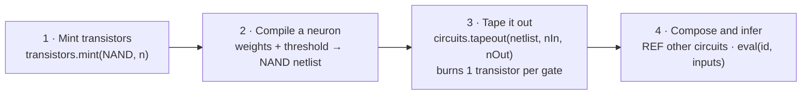
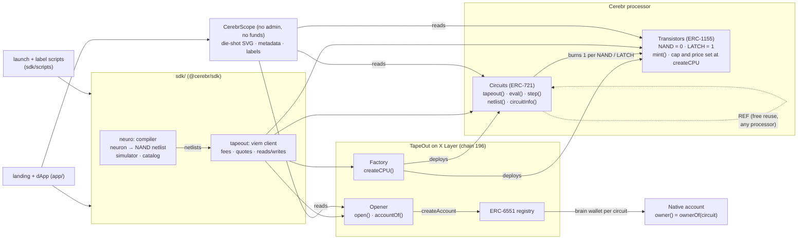

# Cerebr

**A neural processor, taped out onchain.**

Cerebr is a processor created through the [TapeOut](https://tapeout.net) factory on X Layer mainnet, plus a compiler that turns neurons into real NAND netlists. We tape those neurons out as circuits on our own processor. Anyone can run them onchain for free with `eval()`, compose them into deeper networks with `REF`, or tape out their own from the browser.

[**Live app**](https://usecerebr.vercel.app) · [Processor on OKX Explorer](https://www.okx.com/web3/explorer/xlayer/address/0xB04EB79D1A5EECaabAAfF7B77d7c27578EE693FF) · [Submission](SUBMISSION.md) · [TapeOut integration spec](TAPEOUT.md) · [Internal review](AUDIT.md)


Built for the IGNIX X Layer **TapeOut Genesis Transistor** hackathon by NetLayer Labs.

## Contents

- [The idea in one minute](#the-idea-in-one-minute)
- [Live on X Layer mainnet](#live-on-x-layer-mainnet)
- [Hackathon requirements and judging criteria](#hackathon-requirements-and-judging-criteria)
- [How it works](#how-it-works)
- [The circuit catalog](#the-circuit-catalog)
- [The app](#the-app)
- [Architecture](#architecture)
- [Asset issuance](#asset-issuance)
- [Verification and security](#verification-and-security)
- [Quickstart](#quickstart)
- [Using the SDK](#using-the-sdk)
- [Repository layout](#repository-layout)
- [Documentation](#documentation)
- [Risks](#risks)

## The idea in one minute

TapeOut lets anyone create a **processor** on X Layer. Each processor has two contracts:

- **Transistors** (ERC-1155): NAND and LATCH logic gates, minted at a fixed unit price up to a supply cap.
- **Circuits** (ERC-721): netlists of those gates. Taping out a circuit burns one transistor per gate and stores the netlist onchain, where anyone can run it with `eval()`.

Cerebr treats that stack as hardware for neural networks:

| TapeOut primitive | In Cerebr |
|---|---|
| Transistor (NAND, LATCH) | A **synapse**: every gate in a neuron burns one |
| Circuit | A **neuron** or a small **network**, compiled from threshold units into NAND gates |
| `REF` (a circuit calling another circuit) | A **connection** between taped-out neurons: networks reuse neurons without burning new transistors |
| `eval()` / `step()` | **Inference**, gate by gate onchain, as a free view call |
| Native circuit account (ERC-6551) | A **brain wallet**: a neuron can hold assets and act onchain |

The classic demonstration is the **XOR problem**: in 1969 Minsky and Papert showed that a single threshold neuron cannot compute XOR. A two-layer network can. Cerebr tapes out that exact network on X Layer as three neurons wired together with `REF` (circuit #5), and anyone can check its answers onchain.

## Live on X Layer mainnet

Everything below is live on X Layer mainnet (chain 196) and was verified by direct onchain reads on 2026-10-06.

| Component | Address |
|---|---|
| **Cerebr processor** (circuits, ERC-721) | [`0xB04EB79D1A5EECaabAAfF7B77d7c27578EE693FF`](https://www.okx.com/web3/explorer/xlayer/address/0xB04EB79D1A5EECaabAAfF7B77d7c27578EE693FF) |
| Cerebr transistors (ERC-1155) | [`0x84b5a5c6fE305319458113b87c09a2A241427D2D`](https://www.okx.com/web3/explorer/xlayer/address/0x84b5a5c6fE305319458113b87c09a2A241427D2D) |
| Deployment wallet (creator) | [`0xc742AdA2872a042dD36D2E706907b4036968960C`](https://www.okx.com/web3/explorer/xlayer/address/0xc742AdA2872a042dD36D2E706907b4036968960C) |
| CerebrScope (our lens contract) | [`0x2640F8E89b2B107919568FFd42dFb46A1866e528`](https://www.okx.com/web3/explorer/xlayer/address/0x2640F8E89b2B107919568FFd42dFb46A1866e528), source verified on [Sourcify](https://repo.sourcify.dev/contracts/full_match/196/0x2640F8E89b2B107919568FFd42dFb46A1866e528/) (exact match) |
| TapeOut factory | [`0x1f09daefa827f02cbb40967cc91b259763760761`](https://www.okx.com/web3/explorer/xlayer/address/0x1f09daefa827f02cbb40967cc91b259763760761) |
| TapeOut account opener | [`0x536add8f30f03b69f6fbf29d425a816a0dc50106`](https://www.okx.com/web3/explorer/xlayer/address/0x536add8f30f03b69f6fbf29d425a816a0dc50106) |

| Event | Transaction |
|---|---|
| `createCPU("Cerebr", "CRBR", story, 1,000,000, 0.00001 OKB)` | [0x3295…6815](https://www.okx.com/web3/explorer/xlayer/tx/0x3295efc1ceec4aba0f918f89e5316fd62f1f705abdc52d483715e4fcada86815) (block 72,461,494, 2026-10-05) |
| Brain wallet of circuit #5 opened | [0x8781…dad3](https://www.okx.com/web3/explorer/xlayer/tx/0x8781ed8467f4cef1d10dce3ec48cf1da99cfea615b250da8a352eda7a538dad3) → account [`0x9E1d…3166`](https://www.okx.com/web3/explorer/xlayer/address/0x9E1d3eC3B3D0fe84997df0E065a96a7c93c13166) |
| CerebrScope deployed | [0x17d0…9cfd](https://www.okx.com/web3/explorer/xlayer/tx/0x17d01f5dbdc49a9dc88d6fc2f7b347dd55bc903e17fa70cfd2d34ea036359cfd) |
| Onchain names for circuits #1-#14 | 14 `setLabel` transactions on CerebrScope (2026-10-06), written by [`sdk/scripts/label-catalog.ts`](sdk/scripts/label-catalog.ts) |
| Real-wallet test through the live app UI | Mint 10 NAND [0x1fb9…3f2a](https://www.okx.com/web3/explorer/xlayer/tx/0x1fb9dc0eb048bd2d88f985694dc7d7005235dfd7ff27790d44fd4d474af53f2a), tape out circuit #15 [0x4133…1c15](https://www.okx.com/web3/explorer/xlayer/tx/0x413387037233847f2d2dd24c2bfa0733a5300d93e4e4f195d3ac9bd4ca1f1c15), name it onchain [0xc5ff…95fb](https://www.okx.com/web3/explorer/xlayer/tx/0xc5ffa319abb3f5dd0202c4b194efaab71ab6f22d677074050d1403d0f33f95fb) |

State at time of writing: **15 circuits** taped out, **1,251** transistors minted of 1,000,000, the processor registered in the TapeOut factory (`isCPU = true`) and meets TapeOut's app listing rule (supply cap ≥ 10,000, minted ≥ 1). The full launch record, with every transaction, is in [LAUNCH.md](LAUNCH.md#mainnet-launch-record-2026-10-05) and [`launch/out/196.json`](launch/out/196.json).

## Hackathon requirements and judging criteria

| Requirement | How Cerebr meets it | Evidence |
|---|---|---|
| Processor deployed on X Layer **through the TapeOut factory** | `createCPU` on the TapeOut factory; `factory.isCPU(processor) = true` | [create tx](https://www.okx.com/web3/explorer/xlayer/tx/0x3295efc1ceec4aba0f918f89e5316fd62f1f705abdc52d483715e4fcada86815), [`sdk/scripts/launch.ts`](sdk/scripts/launch.ts) |
| Transistor supply, unit price and cap set and disclosed at deployment | **1,000,000 transistors at 0.00001 OKB**, the parameters of `createCPU`, recorded in its `CPUCreated` event and published on the landing page | [ISSUANCE.md](ISSUANCE.md), [`launch/config.json`](launch/config.json) |
| At least one circuit taped out before the window closes | **15 circuits** (#1-#14 catalog, #15 Studio test), all checked onchain against the simulator on every input | [catalog table](#the-circuit-catalog) |
| A clear use case | Verifiable onchain inference: game AI, decision primitives for DeAI agents, and public neurons other teams can `REF` | [SUBMISSION.md](SUBMISSION.md) |
| Mainnet launch | X Layer mainnet, chain 196 | addresses above |

| Judging criterion | Cerebr |
|---|---|
| **Application innovation** | A neural compiler for TapeOut: gates become neurons, `REF` becomes the connections between them, `eval` becomes inference. A spiking neuron runs on LATCH state with `step()`. |
| **Depth of TapeOut integration** | Uses every TapeOut primitive: `createCPU`, `mint` (NAND and LATCH), `tapeout`, `REF`, `eval`, `step`, the circuit NFTs and native accounts (`opener.open`, `accountOf`). Every behaviour was verified on a mainnet fork, then on mainnet ([TAPEOUT.md](TAPEOUT.md)). |
| **Product completeness and UX** | A landing page whose every figure is read live from X Layer, and a four-view dApp: mint, design and tape out a neuron, run inference, browse the gallery and name circuits onchain. Plus an SDK, an onchain lens contract and a one-command launch runbook. |
| **Asset issuance design** | One asset, the transistor: fixed supply and price, burned by use, reuse through `REF` is free. No curve, no presale, no reserved allocation; the creator's own mints are disclosed. See [Asset issuance](#asset-issuance). |
| **Quality of X Layer integration** | Native OKB fees, OKX Wallet first, OKX Explorer links throughout, batched reads against the public X Layer RPC, and ~1-second blocks that make a live tape-out-and-test loop practical. |
| **User growth potential** | Anyone can tape out a neuron in the browser in two transactions and name it onchain; every taped-out neuron is a public building block that any team on any TapeOut processor can `REF` for free. |
| **Contract security and economic model** | No custody. CerebrScope has no admin and no payable functions, and its source is verified. The dApp sends exact live fees. Three internal review rounds, fuzzing against the chain, and TapeOut's own risks disclosed ([AUDIT.md](AUDIT.md), an internal review, not a third-party audit). |

## How it works



### 1. Neurons as threshold units

A Cerebr neuron is a binarized threshold unit:

```
y = [ w0·x0 + w1·x1 + … + wn·xn ≥ θ ]      with weights w ∈ {-1, 0, +1} (up to ±64) and integer θ
```

Excitatory synapses have weight +1, inhibitory -1, absent 0. The neuron fires (outputs 1) when the weighted sum of its binary inputs reaches the threshold θ.

### 2. Compiling to NAND

`sdk/src/neuro` compiles a neuron into TapeOut's only combinational gate, NAND. For each neuron it tries four constructions (two binary-decision-diagram variants and two popcount-and-compare variants, each with its dual) and keeps the netlist with the fewest gates, because every gate costs a transistor. Gate-level optimisation folds constants and reuses identical gates.

Examples from the catalog: an AND neuron is **2 NAND**, an OR neuron **3 NAND**, an inhibitory neuron **1 NAND**, a five-input Go/No-Go neuron **19 NAND**, and the XOR network **6 NAND**.

### 3. The netlist format

A TapeOut netlist is a byte string. Signals are numbered: `0` and `1` are the constants, inputs start at `2`, and every element appends its outputs. The last `nOut` signals are the circuit's outputs.

| Element | Encoding | Meaning |
|---|---|---|
| NAND | `00` · `a:u24` · `b:u24` | new signal = NOT(a AND b) |
| LATCH | `01` · `d:u24` | a one-bit state cell (read with `step()`) |
| REF | `02` · `cpu:address` · `id:u64` · `nIn:u8` · `nOut:u8` · inputs | run another taped-out circuit, on any TapeOut processor |

For example, the AND neuron (#1) is `0x0000000300000200000004000004`: NAND(input0, input1) then NAND of that with itself.

### 4. Composition with REF

`REF` lets a circuit call another taped-out circuit. Cerebr builds networks from neurons that are already onchain: the REF-composed XOR network (#5) is three `REF`s to the OR (#2), inhibitory (#3) and AND (#1) neurons, so it burns **0 transistors** and pays only the tape-out fee. The REF-composed line detector (#12) wires eight line cells (#9) and three pooling neurons (#10, #2) into a 3×3 vision network.

### 5. Inference

`circuits.eval(id, inputs)` runs a circuit gate by gate as a view call: free for the caller, callable by any wallet, script or contract. Inputs and outputs are bit-packed, LSB first. Circuits with LATCH state run with `step(id, state, inputs)`, which returns the next state and the outputs; Cerebr's integrate-and-fire neuron (#14) counts input spikes in two latches and fires on every third.

## The circuit catalog

Every circuit is compiled by the SDK, checked against its reference model on every possible input, taped out on mainnet, and checked again onchain (1,164 input cases across the catalog, all matching).

| Id | Circuit (onchain name) | I/O | Elements | Flat gates | Tape-out tx |
|---|---|---|---|---|---|
| #1 | AND Neuron | 2 → 1 | 2 NAND | 2 | [0xeb5e…8254](https://www.okx.com/web3/explorer/xlayer/tx/0xeb5e9cedb905ad98209f04a40b2a93e7caaadce88f031b2bcb07f21d78d18254) |
| #2 | OR Neuron | 2 → 1 | 3 NAND | 3 | [0x9dbc…0895](https://www.okx.com/web3/explorer/xlayer/tx/0x9dbcfd1e5b9a00083bd1058a83108778cb5f242a19e60f425bd782d8d7770895) |
| #3 | Inhibitory Neuron (NAND) | 2 → 1 | 1 NAND | 1 | [0xab5b…8a81](https://www.okx.com/web3/explorer/xlayer/tx/0xab5badaeb079e3274b02a1642f4f345e4879f6f17373af732e6449dcc2168a81) |
| #4 | The XOR Problem | 2 → 1 | 6 NAND | 6 | [0x4ace…30a8](https://www.okx.com/web3/explorer/xlayer/tx/0x4ace108c8ecb85f8ea47d6a13cc9e96c7e3013a4618ed086401cbce6519930a8) |
| #5 | The XOR Problem (REF-composed) | 2 → 1 | 3 REF | 6 | [0xc3e1…b66e](https://www.okx.com/web3/explorer/xlayer/tx/0xc3e10087944a57070a3f4acf618992085d06d6af5e381b4675d9fd482976b66e) |
| #6 | Majority-3 | 3 → 1 | 6 NAND | 6 | [0x2418…15ca](https://www.okx.com/web3/explorer/xlayer/tx/0x2418f266c2f0ba0b728813c8cf07999ec0fb41efdb81d42b7d1f2b941d3315ca) |
| #7 | Majority-5 | 5 → 1 | 24 NAND | 24 | [0xb25b…5558](https://www.okx.com/web3/explorer/xlayer/tx/0xb25b7f1822c3aa229ec7931ba8728cdb656e8b56f11d430913f87ae095c95558) |
| #8 | Go/No-Go Neuron | 5 → 1 | 19 NAND | 19 | [0xc58e…fd3d](https://www.okx.com/web3/explorer/xlayer/tx/0xc58e60186673067a51e6606901a65195267599730f716180b95ba4ef95d3fd3d) |
| #9 | Line Cell | 3 → 1 | 4 NAND | 4 | [0xdcdf…3819](https://www.okx.com/web3/explorer/xlayer/tx/0xdcdf8f9a4bbb13b57b30f3a8f437499f68e8d0b9fd2e9f41d955043fb9233819) |
| #10 | Any-of-3 Neuron | 3 → 1 | 6 NAND | 6 | [0x57a1…b37a](https://www.okx.com/web3/explorer/xlayer/tx/0x57a1e3547687a8ff7ef97cb01b9366768b295f7c73a1120c4f4461b44e7cb37a) |
| #11 | Line Detector | 9 → 3 | 37 NAND | 37 | [0x69a2…dce5](https://www.okx.com/web3/explorer/xlayer/tx/0x69a23927d56107894ba2b62a4c73829d5770c1db4194d8105a2ed8bb6319dce5) |
| #12 | Line Detector (REF-composed) | 9 → 3 | 11 REF | 47 | [0x65fa…48ea](https://www.okx.com/web3/explorer/xlayer/tx/0x65fa37ad39f3d62ff4088ef352904ec9ee8520ec7ada0326652f13cccc2648ea) |
| #13 | 2-bit Adder | 4 → 3 | 14 NAND | 14 | [0xdbbe…f3f3](https://www.okx.com/web3/explorer/xlayer/tx/0xdbbec9cd6b0909f3e505e3927f6f9e8e3f60e63039fd2aaae9ac01a141dbf3f3) |
| #14 | Integrate-and-Fire Neuron | 2 → 1 | 17 NAND + 2 LATCH | 19 | [0x91e5…7016](https://www.okx.com/web3/explorer/xlayer/tx/0x91e5a6585576e608318a33d7d616b0e6fe769bce3aa3510b9e08782ca11d7016) |
| #15 | Studio test neuron (y = [x0 + x1 + x2 - x3 ≥ 2]) | 4 → 1 | 16 NAND | 16 | [0x4133…1c15](https://www.okx.com/web3/explorer/xlayer/tx/0x413387037233847f2d2dd24c2bfa0733a5300d93e4e4f195d3ac9bd4ca1f1c15) |

#1-#14 were taped out by the launch runbook; #15 was taped out through the live app's Circuit Studio during the real-wallet test. All 15 are owned by the deployment wallet and named onchain in CerebrScope. Gate costs are exact: a circuit burns exactly its NAND and LATCH count in transistors, and `REF`s burn nothing.

## The app

The app at [`/app`](https://usecerebr.vercel.app/app) talks only to X Layer mainnet through an injected wallet (OKX Wallet first). Every figure is read live from chain, every write is simulated before it is sent, and fees are read fresh before each quote.

**Processor**: the processor's live state, its disclosed issuance terms, transistor minting with an exact cost breakdown, and the neural circuit library.


**Circuit Studio**: pick a catalog circuit, design a threshold neuron with toggles for each synapse and a threshold slider, or compose a network from taped-out neurons. The netlist, gate count, cost and full truth table update live. Taping out mints any missing transistors, tapes the circuit out and writes its name onchain.


**Inference**: run any circuit on the processor with `eval()` on X Layer and compare it with the local simulator side by side (they must agree), with gas used and round-trip time. The line detector gets a clickable 3×3 pixel grid; "Run all inputs" checks every input pattern onchain in batched calls.


**Gallery**: every circuit on the processor with a die shot drawn from its real netlist (CerebrScope's onchain SVG is one click away), its owner, its onchain name and its native brain wallet, which the owner can open.


**Genesis Drop**: drop #1 on TapeOut's ownerless drops contract [`0xf037…f9b9`](https://www.okx.com/web3/explorer/xlayer/address/0xf037a5543f19619a2291009ae1542b71d50ff9b9) hands out 400 NAND, 16 per address, one claim each. The Processor view shows its live state and a simulated claim, then sends the claimer to the Studio with a 16-NAND neuron that is not onchain yet, so a first tape-out costs only the tape-out fee.

**Train**: draw examples on a pixel grid (or pick a preset), train a threshold network in the browser, see its weights and held-out score, and when no single neuron fits, the hidden layer it needs. The trained model is compiled to NAND, checked against the model on every input, then taped out and named onchain through the same flow as the Studio.

**Arena**: play tic-tac-toe against circuit #16, a 590-gate neural network, through NeuralArena [`0xD984…62BD`](https://www.okx.com/web3/explorer/xlayer/address/0xD984b3D13603AB51af02ddFFaa1FD86bE8c162BD). Every bot move is an `eval()` of #16 inside your `play()` transaction; the app decodes each move's inference receipt and replays it with `eval()`. A draw is the best a human can get.

**Marketplace**: every Gallery card can list, reprice, delist or buy its circuit on TapeOut's circuit market [`0xd89f…75DB`](https://www.okx.com/web3/explorer/xlayer/address/0xd89f358c48a7B632c9845af2a02A32eB90DD75DB) (single-token approval, 1% fee fixed per listing, the brain wallet moves with the NFT, buys pass the expected price). Cerebr's own wallets never buy.

The landing page at [`/`](https://usecerebr.vercel.app) is styled as a chip datasheet. Its electrical-characteristics table, fees, catalog gate counts, XOR truth table (live `eval()` on #5) and spiking-neuron timing diagram (computed from #14's onchain netlist and checked tick by tick with `step()`) are all read from X Layer at runtime.

## Architecture



| Component | What it does |
|---|---|
| [`sdk/src/neuro`](sdk/src/neuro) | The neural compiler: netlist builder, NAND-optimal gate library, neuron constructions, the catalog and a simulator that matches TapeOut's own client byte for byte. |
| [`sdk/src/tapeout`](sdk/src/tapeout) | A typed viem client for the factory, transistors, circuits, opener and accounts: fees, quotes, reads and writes. |
| [`src/scope/CerebrScope.sol`](src/scope/CerebrScope.sol) | A lens over any TapeOut processor: batch views, gate mix parsed from netlist bytes, onchain SVG die shots and ERC-721 metadata, small truth tables, and a label registry only a circuit's owner can write. No funds, no admin. |
| [`sdk/scripts/launch.ts`](sdk/scripts/launch.ts) | The resumable, idempotent launch runbook: createCPU, mint, tape out in dependency order, verify every circuit onchain, open accounts. Refuses duplicate launches and never prints the key. |
| [`sdk/scripts/label-catalog.ts`](sdk/scripts/label-catalog.ts) | Writes CerebrScope names for the catalog circuits; fork by default, idempotent. |
| [`app/`](app) | The landing page (`/`) and the dApp (`/app`): Vite, React, wagmi and viem, using the SDK from source. |

## Asset issuance

Cerebr has no token of its own. **The asset is the Cerebr processor's transistor.**

| Term | Value |
|---|---|
| Supply cap | **1,000,000** transistors (NAND and LATCH share it) |
| Unit price | **0.00001 OKB** per transistor, paid to the processor's creator |
| TapeOut fees | 0.00066 OKB per mint call, 0.0013 OKB per tape-out, 0.08 OKB to open a brain wallet (read live by the app; TapeOut can change them) |
| Fixed at | `createCPU`, recorded in the `CPUCreated` event; Cerebr cannot change them |

Why these terms: a neural circuit uses many gates, so cheap gates keep a community neuron at a fraction of a cent in transistors (a 150-gate network is about 0.0015 OKB plus fees), while a 1,000,000 cap leaves room for thousands of circuits. Burns never free room under the cap, so transistors only get scarcer with use, and `REF` makes reusing a taped-out neuron free.

**Disclosed creator activity** (no trades, no transfers, every mint a primary mint at the public price):

- Launch: 1,139 NAND + 102 LATCH minted; 141 burned into the 14 catalog circuits; the unit price came back to the creator through `withdraw()`.
- 2026-10-06 real-wallet test of the live app: 10 NAND minted and 16 burned into circuit #15.
- The deployment wallet holds the rest: **994 NAND and 100 LATCH** at time of writing.

Full design, alternatives and the cost of every circuit: [ISSUANCE.md](ISSUANCE.md).

## Verification and security

| Check | Result |
|---|---|
| SDK tests (compiler, simulator, TapeOut client, launch guards) | all pass (`cd sdk && npm test`) |
| CerebrScope Foundry tests | 6 unit and fuzz tests, plus 15 fork tests against the real TapeOut contracts (21 / 21) |
| Simulator vs TapeOut | byte-identical to TapeOut's own client on random netlists with LATCH and REF; 160 random netlists taped out on a fork, 1,920 `eval`/`step` comparisons, 0 mismatches ([AUDIT.md](AUDIT.md#6-round-2-full-audit-2026-10-0506)) |
| Neuron compiler | 331,370 exhaustive cases against the reference model, 0 mismatches ([AUDIT.md](AUDIT.md#6-round-2-full-audit-2026-10-0506)) |
| Mainnet | every catalog circuit's netlist byte-identical to a fresh compile; 1,164 onchain input cases match the simulator; #14 checked with `step()` |
| CerebrScope source | verified on Sourcify, exact match of deployed bytecode |
| dApp | end to end on a mainnet fork as a fresh user, then a real-wallet test on mainnet (mint, inference, tape-out and onchain naming) |

Three internal review rounds are recorded in [AUDIT.md](AUDIT.md) with every finding and its resolution: a 2026-10-04 integration review, a 2026-10-05/06 full audit by three independent agents (dApp transaction paths on a mainnet fork; contracts, SDK and launch; live mainnet and docs), and a 2026-10-06 pre-submission audit. Together they covered CerebrScope, the SDK, the launch scripts, the dApp and the docs. This is an internal review, not a professional third-party audit.

## Quickstart

Requirements: [Foundry](https://book.getfoundry.sh), Node 26 (Node 23.6+ runs the TypeScript sources natively).

```bash
git clone --recurse-submodules https://github.com/NetLayerLabs/Cerebr.git
cd Cerebr

# SDK: compiler + TapeOut client
cd sdk && npm install && npm test && cd ..

# Contracts: CerebrScope (the fork suite is skipped unless SCOPE_FORK_RPC is set)
forge build && forge test

# The app (landing at /, dApp at /app), against X Layer mainnet
cd app && npm install && npm run dev
```

Rehearse everything on a local copy of X Layer mainnet, with nothing broadcast:

```bash
anvil --fork-url https://rpc.xlayer.tech --chain-id 196 --auto-impersonate --port 8545 &
SCOPE_FORK_RPC=http://127.0.0.1:8545 forge test           # CerebrScope against the real TapeOut contracts
cd sdk
FORK_RPC=http://127.0.0.1:8545 node scripts/fork-smoke.ts  # every TapeOut fact the project relies on
node scripts/launch.ts --dry-run                           # the launch plan and its exact OKB cost
node scripts/launch.ts --yes --fresh                       # a full launch rehearsal on the fork
```

Going live on mainnet is documented step by step in [LAUNCH.md](LAUNCH.md); mainnet runs need an explicit `--network xlayer`, a `PRIVATE_KEY` in `sdk/.env` and `--yes`.

## Using the SDK

```ts
import { createPublicClient, http } from 'viem'
import { getCircuit, encodeHex, neuron, tapeout } from '@cerebr/sdk'

const CEREBR = '0xB04EB79D1A5EECaabAAfF7B77d7c27578EE693FF'
const client = createPublicClient({ chain: tapeout.xLayer, transport: http('https://rpc.xlayer.tech') })

// Run the REF-composed XOR network (#5) onchain: x0 = 1, x1 = 0
const [y] = await tapeout.evalCircuit(client, { circuits: CEREBR, id: 5n, inputs: [1, 0] }) // → 1

// Compile your own threshold neuron and inspect its cost
const nl = getCircuit('xor-net').build({ mode: 'direct' })
console.log(nl.counts) // { nand: 6, latch: 0, ref: 0, ... }
console.log(encodeHex(nl))

// Read the processor's live state and fees
const cpu = await tapeout.readCpu(client, CEREBR)
const fees = await tapeout.readFees(client, { circuits: CEREBR })
```

The exact function signatures are in [`sdk/src/tapeout/client.ts`](sdk/src/tapeout/client.ts) and [`sdk/src/neuro/index.ts`](sdk/src/neuro/index.ts); every TapeOut behaviour they rely on is documented in [TAPEOUT.md](TAPEOUT.md).

## Repository layout

```
sdk/src/neuro/       neural compiler: netlist builder, logic, neurons, simulator, catalog
sdk/src/tapeout/     TapeOut client: addresses, ABIs, encoding and quotes, viem reads and writes
sdk/scripts/         fork-smoke.ts, launch.ts (launch runbook), label-catalog.ts (onchain names)
sdk/test/            SDK tests
src/scope/           CerebrScope (lens, die-shot SVG, metadata, labels)
script/              DeployScope.s.sol
test/scope/          CerebrScope unit, fuzz and fork tests
launch/              config.json (identity and issuance terms), out/ and state (mainnet launch records)
app/                 landing page and dApp (Vite, React, wagmi, viem)
media/               screenshots used in this README
```

## Documentation

| Document | Contents |
|---|---|
| [TAPEOUT.md](TAPEOUT.md) | The TapeOut integration spec as verified on a mainnet fork: addresses, fees, netlist format, REF rules, costs and error strings |
| [LAUNCH.md](LAUNCH.md) | The mainnet launch runbook, checklist and the full launch record |
| [ISSUANCE.md](ISSUANCE.md) | Transistor issuance design, alternatives, the cost of each circuit, fee flows and the anti-wash-trading stance |
| [SUBMISSION.md](SUBMISSION.md) | The hackathon submission and demo script |
| [AUDIT.md](AUDIT.md) | The internal security review and its findings |
| [app/README.md](app/README.md) | Running, building and deploying the app |

## Risks

TapeOut's X Layer contracts are in a test phase: they are upgradeable and unaudited, and their owner can change code and fees. Cerebr holds no user funds; mints, tape-outs and wallet openings are direct calls to TapeOut's contracts. CerebrScope is a lens with no payable functions and no admin. Circuits run as view calls with gas limits, so onchain networks stay small, from tens to hundreds of gates. Nothing here is investment advice.

## License

[MIT](LICENSE) · Built by NetLayer Labs
