# Cerebr

**A neural processor, taped out onchain.**

Cerebr is a TapeOut processor on X Layer mainnet, plus a compiler that turns neurons into real NAND netlists. We tape those neurons out as circuits on our own processor. Anyone can run them onchain for free with `eval()`, wire them into deeper networks with `REF`, train and tape out their own from the browser, play a game against one, and watch an autonomous agent that uses one as its brain.

[**Live app: cerebr.xyz**](https://cerebr.xyz) · [Processor on OKX Explorer](https://www.okx.com/web3/explorer/xlayer/address/0xB04EB79D1A5EECaabAAfF7B77d7c27578EE693FF) · [Submission](SUBMISSION.md) · [TapeOut integration spec](TAPEOUT.md) · [Agent](AGENT.md) · [Arena](ARENA.md) · [Internal review](AUDIT.md)

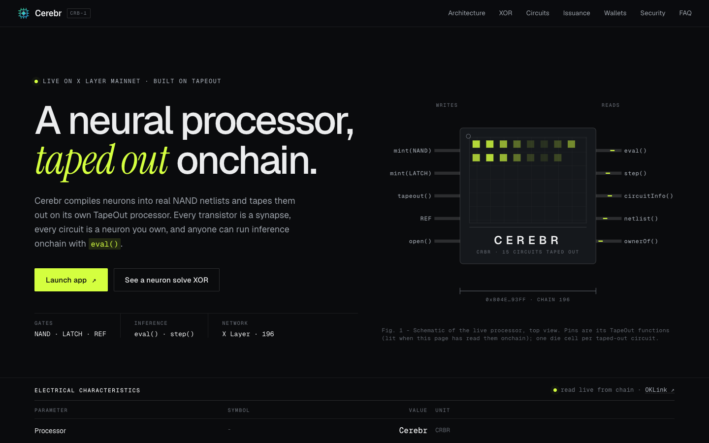

Built by NetLayer Labs for the IGNIX X Layer **TapeOut Genesis Transistor** hackathon.

## At a glance

| | |
|---|---|
| **Network** | X Layer mainnet (chain 196), live since 2026-10-05 |
| **Processor** | Cerebr (CRBR), created through the TapeOut factory: 1,000,000 transistors at 0.00001 OKB |
| **Circuits taped out** | **16**, from a 1-NAND inhibitory neuron to a 590-NAND, 7-layer tic-tac-toe network |
| **Our contracts on mainnet** | CerebrScope (lens and onchain names), NeuralArena (game), CerebrAgent (autonomous agent). All three have verified source (Sourcify exact match), no admin and no payable functions |
| **TapeOut features used** | factory, transistors (NAND and LATCH), circuits, `REF`, `eval`, `step`, native brain wallets, the drops contract and the circuit marketplace |
| **Autonomous agent** | Live. A keeper on our VPS calls the agent every 10 minutes; circuit #8 decides each time |
| **App** | Landing page plus a 7-view dApp, all data read live from X Layer, in English and 简体中文, dark and light themes, desktop and mobile wallets |
| **Tests** | 90 SDK tests, 43 Foundry unit and fuzz tests plus fork suites against the real TapeOut contracts, end-to-end runs of every feature on a mainnet fork |

## Contents

- [The idea in one minute](#the-idea-in-one-minute)
- [Live on X Layer mainnet](#live-on-x-layer-mainnet)
- [Why Cerebr](#why-cerebr)
- [Product tour](#product-tour)
- [How it works](#how-it-works)
- [Cerebr Agent: a neuron that acts onchain](#cerebr-agent-a-neuron-that-acts-onchain)
- [NeuralArena: play a neural network](#neuralarena-play-a-neural-network)
- [The circuit catalog](#the-circuit-catalog)
- [Architecture](#architecture)
- [Asset issuance](#asset-issuance)
- [Design and user experience](#design-and-user-experience)
- [Verification and security](#verification-and-security)
- [Build log](#build-log)
- [Quickstart](#quickstart)
- [Using the SDK](#using-the-sdk)
- [Repository layout](#repository-layout)
- [Documentation](#documentation)
- [Risks](#risks)

## The idea in one minute

TapeOut lets anyone create a **processor** on X Layer. Each processor has two contracts:

- **Transistors** (ERC-1155): NAND and LATCH logic gates, minted at a fixed unit price up to a supply cap.
- **Circuits** (ERC-721): netlists of those gates. Taping out a circuit burns one transistor per gate and stores the netlist onchain, where anyone can run it with `eval()`.

Cerebr treats that stack as hardware for neural networks:

| TapeOut primitive | In Cerebr |
|---|---|
| Transistor (NAND, LATCH) | A **synapse**: every gate in a neuron burns one |
| Circuit | A **neuron** or a small **network**, compiled from threshold units into NAND gates |
| `REF` (a circuit calling another circuit) | A **connection** between taped-out neurons: networks reuse neurons without burning new transistors |
| `eval()` / `step()` | **Inference**, gate by gate onchain, as a free view call |
| Native circuit account (ERC-6551) | A **brain wallet**: a neuron can hold assets and act onchain |

The classic demonstration is the **XOR problem**: in 1969 Minsky and Papert showed that a single threshold neuron cannot compute XOR. A two-layer network can. Cerebr tapes out that exact network on X Layer as three neurons wired together with `REF` (circuit #5), and anyone can check its answers onchain.

From there we built up: a trainer that finds the network for your own examples, a 590-gate network that plays tic-tac-toe and never loses, and an agent whose every decision is one inference of a taped-out neuron.

## Live on X Layer mainnet

Everything below is live on X Layer mainnet (chain 196) and was checked by direct onchain reads on 2026-10-06.

**Contracts**

| Component | Address |
|---|---|
| **Cerebr processor** (circuits, ERC-721) | [`0xB04EB79D1A5EECaabAAfF7B77d7c27578EE693FF`](https://www.okx.com/web3/explorer/xlayer/address/0xB04EB79D1A5EECaabAAfF7B77d7c27578EE693FF) |
| Cerebr transistors (ERC-1155) | [`0x84b5a5c6fE305319458113b87c09a2A241427D2D`](https://www.okx.com/web3/explorer/xlayer/address/0x84b5a5c6fE305319458113b87c09a2A241427D2D) |
| Deployment wallet (creator) | [`0xc742AdA2872a042dD36D2E706907b4036968960C`](https://www.okx.com/web3/explorer/xlayer/address/0xc742AdA2872a042dD36D2E706907b4036968960C) |
| **CerebrScope** (ours: lens, die shots, onchain names) | [`0x2640F8E89b2B107919568FFd42dFb46A1866e528`](https://www.okx.com/web3/explorer/xlayer/address/0x2640F8E89b2B107919568FFd42dFb46A1866e528), Sourcify exact match |
| **NeuralArena** (ours: tic-tac-toe against circuit #16) | [`0xD984b3D13603AB51af02ddFFaa1FD86bE8c162BD`](https://www.okx.com/web3/explorer/xlayer/address/0xD984b3D13603AB51af02ddFFaa1FD86bE8c162BD), Sourcify exact match |
| **CerebrAgent** (ours: autonomous agent, policy circuit #8) | [`0x3d736c6419dCa667a351907578b68717Cd6e3340`](https://www.okx.com/web3/explorer/xlayer/address/0x3d736c6419dCa667a351907578b68717Cd6e3340), Sourcify exact match |
| Agent keeper wallet (gas only) | [`0x09a00521Ff00407f81963FcE5D4D20917289902A`](https://www.okx.com/web3/explorer/xlayer/address/0x09a00521Ff00407f81963FcE5D4D20917289902A) |
| TapeOut factory | [`0x1f09daefa827f02cbb40967cc91b259763760761`](https://www.okx.com/web3/explorer/xlayer/address/0x1f09daefa827f02cbb40967cc91b259763760761) |
| TapeOut account opener | [`0x536add8f30f03b69f6fbf29d425a816a0dc50106`](https://www.okx.com/web3/explorer/xlayer/address/0x536add8f30f03b69f6fbf29d425a816a0dc50106) |
| Drops (Genesis Drop #1): an ownerless instance of TapeOut's drops contract, deployed by Cerebr | [`0xf037a5543f19619a2291009ae1542b71d50ff9b9`](https://www.okx.com/web3/explorer/xlayer/address/0xf037a5543f19619a2291009ae1542b71d50ff9b9) |
| TapeOut circuit market | [`0xd89f358c48a7B632c9845af2a02A32eB90DD75DB`](https://www.okx.com/web3/explorer/xlayer/address/0xd89f358c48a7B632c9845af2a02A32eB90DD75DB) |

**Key transactions**

| Event | Transaction |
|---|---|
| `createCPU("Cerebr", "CRBR", story, 1,000,000, 0.00001 OKB)` | [0x3295…6815](https://www.okx.com/web3/explorer/xlayer/tx/0x3295efc1ceec4aba0f918f89e5316fd62f1f705abdc52d483715e4fcada86815) (block 72,461,494, 2026-10-05) |
| Catalog circuits #1-#14 taped out | see [the circuit catalog](#the-circuit-catalog) and [LAUNCH.md](LAUNCH.md#mainnet-launch-record-2026-10-05) |
| Brain wallet of circuit #5 opened | [0x8781…dad3](https://www.okx.com/web3/explorer/xlayer/tx/0x8781ed8467f4cef1d10dce3ec48cf1da99cfea615b250da8a352eda7a538dad3) → account [`0x9E1d…3166`](https://www.okx.com/web3/explorer/xlayer/address/0x9E1d3eC3B3D0fe84997df0E065a96a7c93c13166) |
| CerebrScope deployed | [0x17d0…9cfd](https://www.okx.com/web3/explorer/xlayer/tx/0x17d01f5dbdc49a9dc88d6fc2f7b347dd55bc903e17fa70cfd2d34ea036359cfd) |
| Onchain names for circuits #1-#14 | 14 `setLabel` transactions on CerebrScope, written by [`sdk/scripts/label-catalog.ts`](sdk/scripts/label-catalog.ts) |
| Real-wallet test through the live app | mint 10 NAND [0x1fb9…3f2a](https://www.okx.com/web3/explorer/xlayer/tx/0x1fb9dc0eb048bd2d88f985694dc7d7005235dfd7ff27790d44fd4d474af53f2a), tape out #15 [0x4133…1c15](https://www.okx.com/web3/explorer/xlayer/tx/0x413387037233847f2d2dd24c2bfa0733a5300d93e4e4f195d3ac9bd4ca1f1c15), name it [0xc5ff…95fb](https://www.okx.com/web3/explorer/xlayer/tx/0xc5ffa319abb3f5dd0202c4b194efaab71ab6f22d677074050d1403d0f33f95fb), relabel it "Vote-with-veto neuron" [0x2778…099a](https://www.okx.com/web3/explorer/xlayer/tx/0x277868e6de15edc615d8dd963074018fb559470e15d27daac193089f17f8099a) (block 72,516,013) |
| NeuralArena bot taped out (#16, 590 NAND) | [0x0867…6f78](https://www.okx.com/web3/explorer/xlayer/tx/0x0867ed331fa75965a70facd01b0a0f0f456c9c0be33b4e0f5787f5eec70b6f78), named [0x8ba8…f65c](https://www.okx.com/web3/explorer/xlayer/tx/0x8ba86cbbad574129c4060c19d7f9be7a7148810ef01c7a4b4d2913e6c2b7f65c) |
| Drops contract deployed (TapeOut's published drops bytecode, ownerless) | [0xd0f4…8e02](https://www.okx.com/web3/explorer/xlayer/tx/0xd0f4367fc525a3500658953c334adafbe490b16040e71cdbab6f8ad3bfcb8e02) (block 72,516,039) |
| Genesis Drop #1 created (400 NAND, 16 per claim) | [0x2d7c…8f20](https://www.okx.com/web3/explorer/xlayer/tx/0x2d7c052914b7e7a441b721ed025ce7e9bf832fb9804b85b885e6160ab1598f20) (block 72,516,049) |
| First Genesis Drop claim (Cerebr team test wallet, disclosed, 16 NAND) | [0x4d18…2db6](https://www.okx.com/web3/explorer/xlayer/tx/0x4d186077dfab5eb3f5c25e0876d549ef9367ac1ac385105939928cde91ec2db6) (block 72,527,608) |
| NeuralArena deployed | [0xd794…4748](https://www.okx.com/web3/explorer/xlayer/tx/0xd794960051024427817ca50db7025090e2dddf6ab664050caf184fd027d34748) |
| CerebrAgent deployed | [0xa9aa…a31f](https://www.okx.com/web3/explorer/xlayer/tx/0xa9aaacef0f3af99dc0046a67d5e3132879c65301415fca4b10202d617e15a31f) |
| Agent keeper funded (0.02 OKB) | [0x0905…263a](https://www.okx.com/web3/explorer/xlayer/tx/0x0905fa6ea415e31ccd8e473ff3643620835cda2946fcdd32c10ec850aaa3263a) |
| First autonomous decision (Go) | [0xb738…c4ed](https://www.okx.com/web3/explorer/xlayer/tx/0xb738dac247760db5bad17709b019a953384132cf5e9c558698a69e7925e2c4ed), block 72,525,341 |

State at time of writing: **16 circuits** (`nextId()` = 16), **1,251** transistors minted of 1,000,000, the processor registered in the TapeOut factory (`isCPU = true`) and meeting TapeOut's app listing rule (supply cap ≥ 10,000, minted ≥ 1). The full launch record, with every transaction, is in [LAUNCH.md](LAUNCH.md#mainnet-launch-record-2026-10-05) and [`launch/out/196.json`](launch/out/196.json).

## Why Cerebr

| | |
|---|---|
| **What's new** | A neural compiler for TapeOut: gates become neurons, `REF` becomes the connections between them, `eval` becomes inference. A spiking neuron runs on LATCH state with `step()`. In-browser training that finds the hidden layer when one neuron is not enough. An autonomous agent whose policy is a taped-out circuit, and a game opponent that is a 590-gate network. |
| **Built on all of TapeOut** | Uses every TapeOut primitive: `createCPU`, `mint` (NAND and LATCH), `tapeout`, `REF`, `eval`, `step`, the circuit NFTs, native brain wallets (`opener.open`, `accountOf`), the drops contract (an ownerless instance of TapeOut's published bytecode, deployed by Cerebr) and the circuit marketplace. Two of our contracts call `eval()` from inside a transaction. Every behaviour was verified on a mainnet fork, then on mainnet ([TAPEOUT.md](TAPEOUT.md)). |
| **A complete product** | A landing page whose every figure is read live from X Layer and a 7-view dApp (Processor, Circuit Studio, Train, Inference, Arena, Gallery, Agent). Two languages, two themes, mobile wallet deep links, simulated writes and exact fee quotes. Plus an SDK, three verified contracts, a launch runbook and a production keeper service. |
| **Issuance** | One asset, the transistor: fixed supply and price, burned by use, reuse through `REF` is free. No curve, no presale, no reserved allocation; the creator's mints are disclosed. A Genesis Drop of 400 NAND hands new builders 16 each; the one claim so far is our own disclosed test. See [Asset issuance](#asset-issuance). |
| **Made for X Layer** | Native OKB fees, OKX Wallet first (with deep links into the OKX and MetaMask apps on mobile), OKX Explorer links throughout, batched reads against the public X Layer RPC, gas from `eth_estimateGas`, and ~1-second blocks that make a live tape-out-and-test loop and a 10-minute agent practical. Handles X Layer specifics such as `eth_call` seeing a basefee of 0. |
| **Room to grow** | A first neuron costs two transactions; the Genesis Drop pays the transistors. Every taped-out neuron is a public building block that any team on any TapeOut processor can `REF` for free. Circuits can be listed and bought on the TapeOut market. The Arena and Agent give non-builders a reason to visit. |
| **Security** | No custody. Our three contracts have no admin and no payable functions, and their source is verified. Gas-capped inference with strict decoding, so a bad circuit can never block a game or the agent. The keeper is permissionless and holds only gas money. Internal review rounds, fuzzing and fork tests ([AUDIT.md](AUDIT.md), an internal review, not a third-party audit). |

Hackathon eligibility (processor created through the TapeOut factory, issuance disclosed, circuits taped out, use case, mainnet) is checked off with evidence in [SUBMISSION.md](SUBMISSION.md#eligibility).

## Product tour

The app at [`cerebr.xyz/app`](https://cerebr.xyz/app) talks only to X Layer mainnet. Every figure is read live from chain, every write is simulated before it is sent, and fees are read fresh before each quote. The screenshots below show real mainnet data.

**Processor**: the processor's live state, its disclosed issuance terms, transistor minting with an exact cost breakdown, the neural circuit library, and the Genesis Drop card.

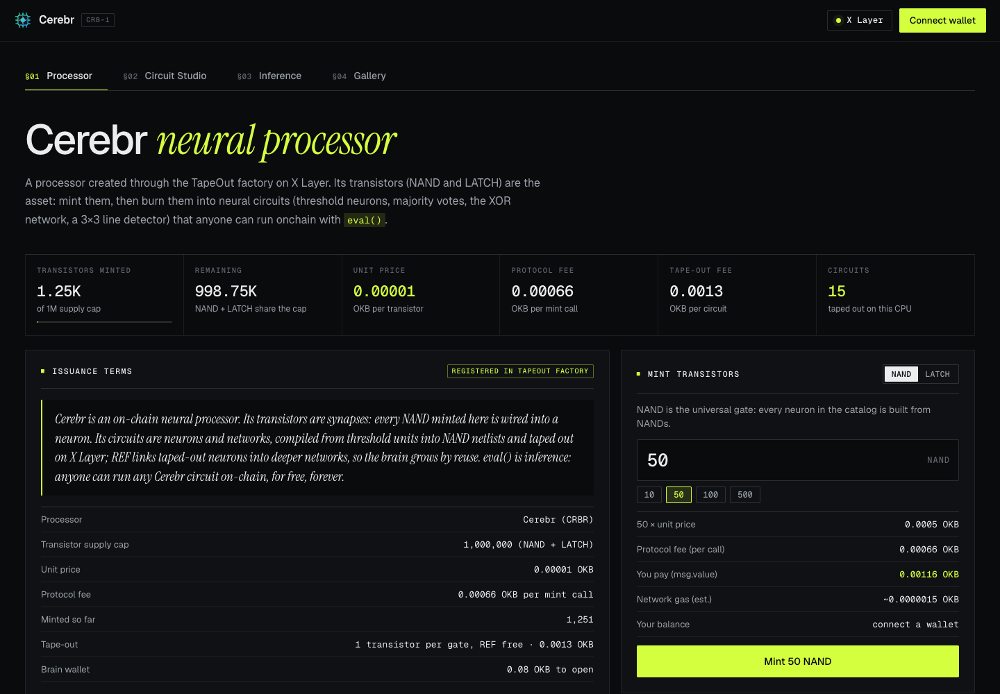

**Genesis Drop**: drop #1, on an ownerless instance of TapeOut's drops contract deployed by Cerebr, hands out 400 NAND, 16 per address, one claim each. The app reads the drop live, simulates the claim, then sends the claimer to the Studio with a 16-NAND neuron that is not onchain yet (picked from 10, so claimers do not all copy one circuit). A first tape-out then costs only TapeOut's fee.

**Circuit Studio**: pick a catalog circuit, design a threshold neuron with a toggle per synapse and a threshold slider, or compose a network from taped-out neurons. The netlist, gate count, cost and full truth table update live. Taping out mints any missing transistors, tapes the circuit out and writes its name onchain.

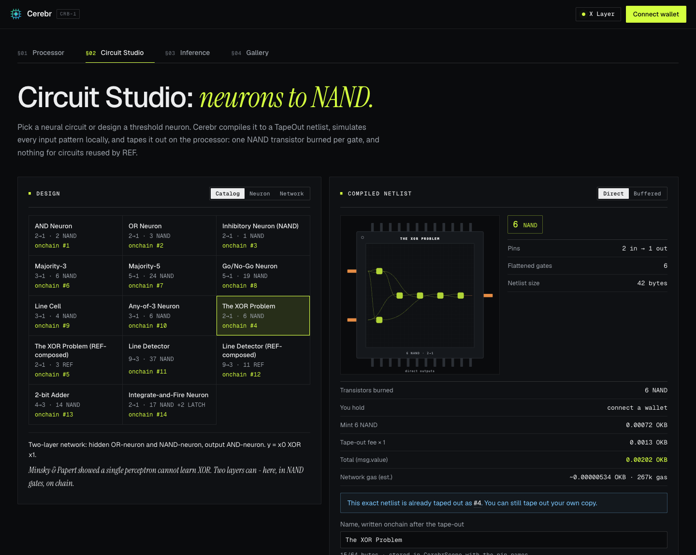

**Train**: draw examples on a pixel grid (or pick a preset), train a threshold network in the browser, and check it on held-out drawings. When no single neuron fits, an exact search proves it and adds the hidden layer the problem needs: the XOR moment, live. The trained model is compiled to NAND, checked on every possible input, then taped out and named onchain. If the examples change after training, the app requires a retrain before taping out.

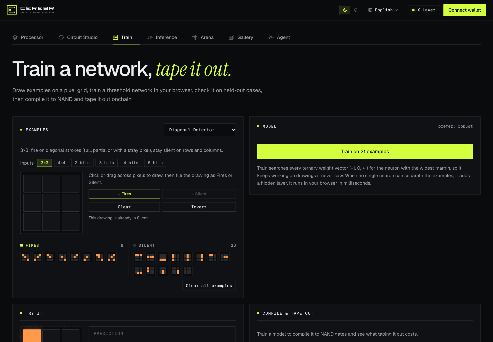

**Inference**: run any circuit with `eval()` on X Layer next to the local simulator (they must agree), with gas used and round-trip time. A gate animation shows signals flowing through the circuit layer by layer. "Run all inputs" checks every input pattern onchain in batched calls.

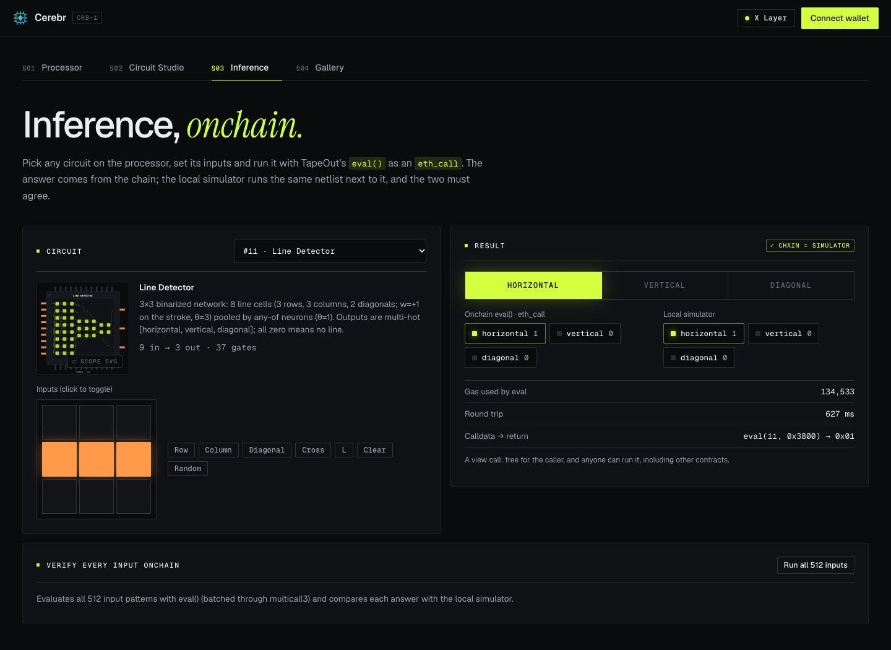

**Arena**: play tic-tac-toe against circuit #16, a 590-gate neural network, through NeuralArena. Every bot move is an `eval()` of #16 inside your own `play()` transaction; the app decodes each move's inference receipt and replays it with `eval()`. You can preview the bot's reply before you move. A draw is the best a human can get. See [NeuralArena](#neuralarena-play-a-neural-network).

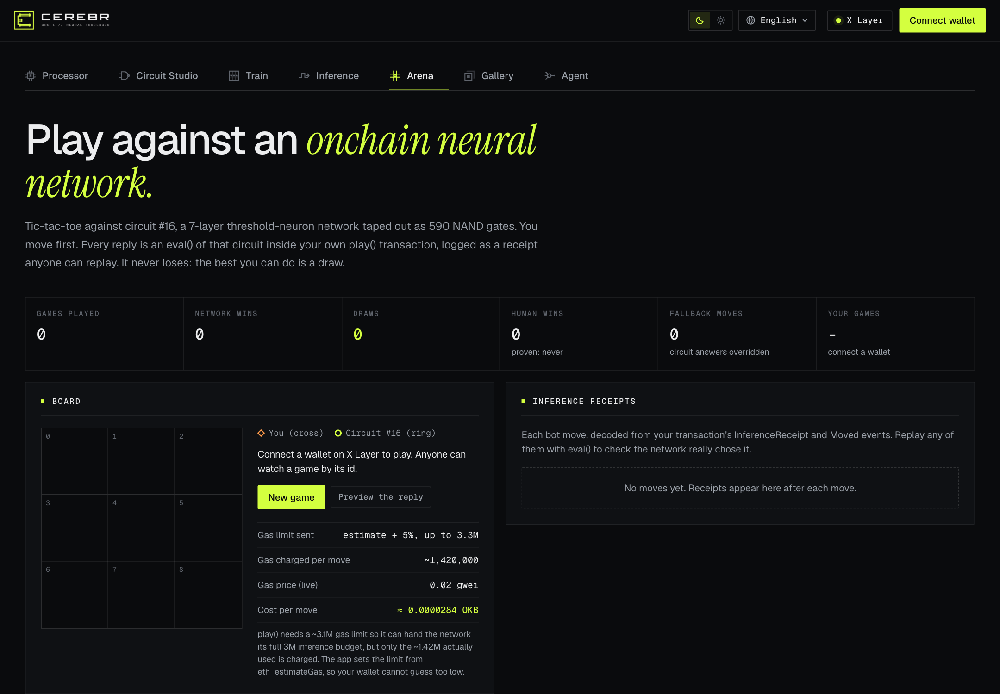

**Gallery and marketplace**: every circuit on the processor with a die shot drawn from its real netlist (CerebrScope's onchain SVG is one click away), its owner, its onchain name and its native brain wallet, which the owner can open. Each card can list, reprice, delist or buy its circuit on TapeOut's circuit market (single-token approval, the brain wallet moves with the NFT, buys pass the expected price), with a "For sale" filter. Cerebr's own wallets never buy.

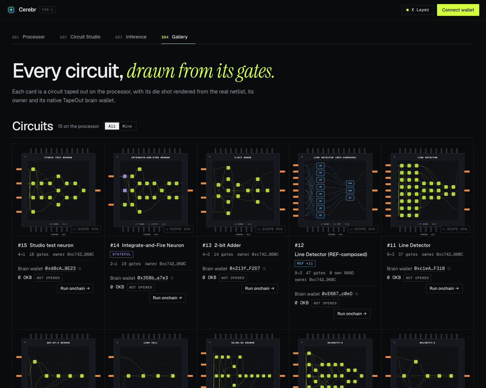

**Agent**: CerebrAgent, live. The five input pins the neuron would see right now with their readings and weights, the weighted sum against the threshold, a countdown to the next allowed decision, the decision feed from the contract with a per-row and "Replay all" check through `eval()`, a timeline strip and every address. No wallet needed. See [Cerebr Agent](#cerebr-agent-a-neuron-that-acts-onchain).


**Landing page**: styled as a chip datasheet. Its electrical-characteristics table, fees, catalog gate counts, XOR truth table (a live `eval()` of #5) and spiking-neuron timing diagram (computed from #14's onchain netlist and checked tick by tick with `step()`) are all read from X Layer at runtime.

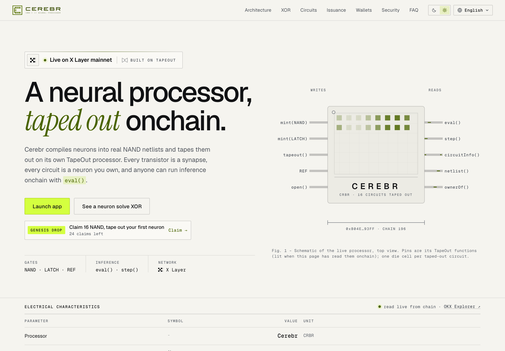

## How it works

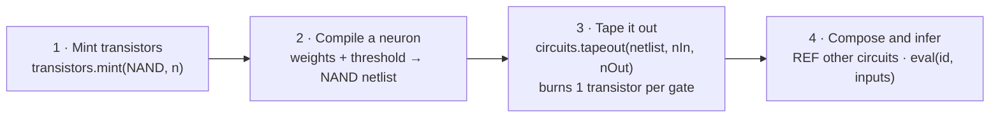

### 1. Neurons as threshold units

A Cerebr neuron is a binarized threshold unit:

```
y = [ w0·x0 + w1·x1 + … + wn·xn ≥ θ ]      with weights w ∈ {-1, 0, +1} (up to ±64) and integer θ
```

Excitatory synapses have weight +1, inhibitory -1, absent 0. The neuron fires (outputs 1) when the weighted sum of its binary inputs reaches the threshold θ.

### 2. Compiling to NAND

`sdk/src/neuro` compiles a neuron into TapeOut's only combinational gate, NAND. For each neuron it tries four constructions (two binary-decision-diagram variants and two popcount-and-compare variants, each with its dual) and keeps the netlist with the fewest gates, because every gate costs a transistor. Gate-level optimisation folds constants and reuses identical gates.

Examples from the catalog: an AND neuron is **2 NAND**, an OR neuron **3 NAND**, an inhibitory neuron **1 NAND**, a five-input Go/No-Go neuron **19 NAND**, and the XOR network **6 NAND**.

### 3. The netlist format

A TapeOut netlist is a byte string. Signals are numbered: `0` and `1` are the constants, inputs start at `2`, and every element appends its outputs. The last `nOut` signals are the circuit's outputs.

| Element | Encoding | Meaning |
|---|---|---|
| NAND | `00` · `a:u24` · `b:u24` | new signal = NOT(a AND b) |
| LATCH | `01` · `d:u24` | a one-bit state cell (read with `step()`) |
| REF | `02` · `cpu:address` · `id:u64` · `nIn:u8` · `nOut:u8` · inputs | run another taped-out circuit, on any TapeOut processor |

For example, the AND neuron (#1) is `0x0000000300000200000004000004`: NAND(input0, input1) then NAND of that with itself.

### 4. Composition with REF

`REF` lets a circuit call another taped-out circuit. Cerebr builds networks from neurons that are already onchain: the REF-composed XOR network (#5) is three `REF`s to the OR (#2), inhibitory (#3) and AND (#1) neurons, so it burns **0 transistors** and pays only the tape-out fee. The REF-composed line detector (#12) wires eight line cells (#9) and three pooling neurons (#10, #2) into a 3×3 vision network.

### 5. Inference

`circuits.eval(id, inputs)` runs a circuit gate by gate as a view call: free for the caller, callable by any wallet, script or contract. Inputs and outputs are bit-packed, LSB first. Circuits with LATCH state run with `step(id, state, inputs)`, which returns the next state and the outputs; Cerebr's integrate-and-fire neuron (#14) counts input spikes in two latches and fires on every third.

### 6. Training

The Train view searches for the network that fits the user's examples. It first runs an exact search for a single neuron with weights in {-1, 0, +1}; if none exists, that is a proof, and the trainer adds a hidden layer of neurons that each fire on some positive examples and no negative ones, joined by an OR. It prefers the model with the widest margin, reports held-out accuracy, compiles the result to NAND and checks the netlist against the model on every possible input (for example all 2^9 = 512 inputs of a 3×3 grid) before it can be taped out.

## Cerebr Agent: a neuron that acts onchain

CerebrAgent is an autonomous onchain agent whose decision policy is a taped-out circuit: **#8, the 19-NAND Go/No-Go Neuron**, `y = [e0 + e1 + e2 - i0 - i1 ≥ 2]`. Every 10 minutes it observes the chain, asks the neuron, and records a verdict that anyone can replay. Its signal answers one question in public: is this a good moment for onchain activity?

### The five input pins

| Pin | Name | Weight | Fires when |
|---|---|---|---|
| e0 | CALM | +1 | the basefee is at or below 0.05 gwei |
| e1 | ACTIVE | +1 | the UTC hour is in [13, 21) |
| e2 | RESTED | +1 | the last Go was at least 43,200 blocks (~12 h) ago, or never |
| i0 | SPIKE | -1 | the basefee is above 1.5 × its moving average (EMA, α = 1/8) |
| i1 | REFRACTORY | -1 | the last Go was less than 3,600 blocks (~1 h) ago |

The contract derives all five pins itself from chain state. Nobody can feed it inputs, so nobody can steer its verdict.

### How the VPS connects to the smart contract

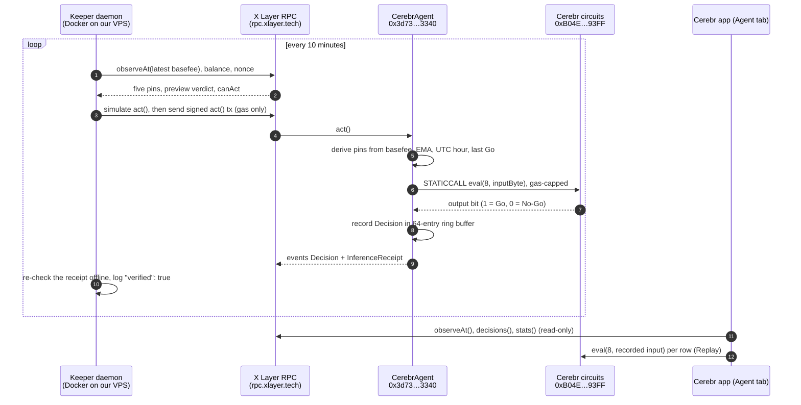

The keeper and the app never talk to each other. The VPS only **writes** to the contract (one `act()` transaction per cycle, signed by a hot wallet that holds gas money). The app only **reads** from the contract through the public RPC. The chain is the single source of truth, so the Agent tab shows exactly what the contract recorded, and any visitor can re-run each decision.

### Trust model

- **Permissionless.** `act()` can be called by anyone; our keeper is a convenience, not a trusted party. It cannot choose the inputs or the verdict, only when the next decision happens, and the contract rate-limits that to one per 300 blocks (~5 minutes).
- **No funds, no admin.** The contract holds nothing, is not payable and has no owner. Configuration is immutable and checked at construction, including a smoke test of circuit #8 on all 32 inputs.
- **It cannot be bricked.** Inference is a gas-capped `STATICCALL` with strict decoding (exact return size, zero padding, an output of 0 or 1). Any failure is recorded as Abstain with a reason; the agent keeps running.
- **Replayable.** Every record stores its input byte and output, so `circuits.eval(8, input)` must return the recorded output, and `replay(seq)` re-derives it inside the contract. The app does both per row.
- **Brain wallet ready.** The agent knows circuit #8's native TapeOut account; a decision sent through that account is flagged `viaBrainWallet`, so the neuron can act through its own wallet once it is opened.

### The keeper service

[`agent/`](agent) is a Node 26 TypeScript daemon (viem only) that imports the same SDK code as the app.

- One transaction in flight, persisted state, same-nonce fee bumps for stuck transactions, retries with backoff.
- Guards: `NETWORK` must be explicit, mainnet requires chain id 196 and a non-dev node, it refuses to start below a minimum balance, and fee caps skip a cycle if gas spikes.
- The private key is removed from the environment after loading and redacted in every log line.
- Dry-run mode observes and simulates without sending; we ran it first on mainnet before going live.
- Read-only `/health` and `/status` endpoints for monitoring.

It runs on our VPS as its own Docker container, isolated from the other services on that machine: its own network and volume, a read-only file system, all Linux capabilities dropped, no new privileges, 256 MB of memory, half a CPU core, and a status port bound to the VPS loopback only. Docker restarts it if it stops; log files are rotated.

### Measured cost

| Action | Gas | OKB at 0.02 gwei |
|---|---|---|
| Deploy | 3,670,007 | 0.0000734 |
| `act()`, first decision | 179,741 | 0.0000036 |
| `act()`, steady state | ~128,000-160,000 | ~0.0000026-0.0000032 |
| Per day at 10-minute cycles | | ~0.00037 |

The keeper's 0.02 OKB lasts about 51 days. Everything else, from the input mapping to verification commands, is in [AGENT.md](AGENT.md) and [agent/README.md](agent/README.md).

## NeuralArena: play a neural network

NeuralArena ([`0xD984…62BD`](https://www.okx.com/web3/explorer/xlayer/address/0xD984b3D13603AB51af02ddFFaa1FD86bE8c162BD)) is tic-tac-toe against circuit **#16**, a 7-layer network of 362 threshold neurons compiled to **590 NAND gates** (18 inputs: one bit per cell for each player; 9 one-hot outputs: the bot's move).

- The policy (win, block, safe threat, centre, corner, edge) was checked against an independently written reference on **all 19,683 boards**. Walking the full game tree with the human moving first gives 457 games: **0 human wins**, 346 bot wins and 111 draws.
- Each `play(gameId, cell)` applies the human move, encodes the board as 18 bits and calls `eval()` on #16 as a gas-capped `STATICCALL`. The arena checks the answer (exactly one bit, on an empty cell); if a circuit ever misbehaved it would fall back to a fixed order and log it, so a game can never get stuck.
- Every move emits an `InferenceReceipt` with the exact input and output, so anyone can replay it with `eval()`.
- A move costs about 1.42M gas (~0.0000284 OKB). `play()` needs a gas limit of about 3.1M so it can hand the network its full inference budget; the app sets it from `eth_estimateGas`.

Details, tests and the mainnet record: [ARENA.md](ARENA.md).

## The circuit catalog

Every circuit is compiled by the SDK, checked against its reference model on every possible input, taped out on mainnet, and checked again onchain.

| Id | Circuit (onchain name) | I/O | Elements | Flat gates | Tape-out tx |
|---|---|---|---|---|---|
| #1 | AND Neuron | 2 → 1 | 2 NAND | 2 | [0xeb5e…8254](https://www.okx.com/web3/explorer/xlayer/tx/0xeb5e9cedb905ad98209f04a40b2a93e7caaadce88f031b2bcb07f21d78d18254) |
| #2 | OR Neuron | 2 → 1 | 3 NAND | 3 | [0x9dbc…0895](https://www.okx.com/web3/explorer/xlayer/tx/0x9dbcfd1e5b9a00083bd1058a83108778cb5f242a19e60f425bd782d8d7770895) |
| #3 | Inhibitory Neuron (NAND) | 2 → 1 | 1 NAND | 1 | [0xab5b…8a81](https://www.okx.com/web3/explorer/xlayer/tx/0xab5badaeb079e3274b02a1642f4f345e4879f6f17373af732e6449dcc2168a81) |
| #4 | The XOR Problem | 2 → 1 | 6 NAND | 6 | [0x4ace…30a8](https://www.okx.com/web3/explorer/xlayer/tx/0x4ace108c8ecb85f8ea47d6a13cc9e96c7e3013a4618ed086401cbce6519930a8) |
| #5 | The XOR Problem (REF-composed) | 2 → 1 | 3 REF | 6 | [0xc3e1…b66e](https://www.okx.com/web3/explorer/xlayer/tx/0xc3e10087944a57070a3f4acf618992085d06d6af5e381b4675d9fd482976b66e) |
| #6 | Majority-3 | 3 → 1 | 6 NAND | 6 | [0x2418…15ca](https://www.okx.com/web3/explorer/xlayer/tx/0x2418f266c2f0ba0b728813c8cf07999ec0fb41efdb81d42b7d1f2b941d3315ca) |
| #7 | Majority-5 | 5 → 1 | 24 NAND | 24 | [0xb25b…5558](https://www.okx.com/web3/explorer/xlayer/tx/0xb25b7f1822c3aa229ec7931ba8728cdb656e8b56f11d430913f87ae095c95558) |
| #8 | Go/No-Go Neuron (CerebrAgent's brain) | 5 → 1 | 19 NAND | 19 | [0xc58e…fd3d](https://www.okx.com/web3/explorer/xlayer/tx/0xc58e60186673067a51e6606901a65195267599730f716180b95ba4ef95d3fd3d) |
| #9 | Line Cell | 3 → 1 | 4 NAND | 4 | [0xdcdf…3819](https://www.okx.com/web3/explorer/xlayer/tx/0xdcdf8f9a4bbb13b57b30f3a8f437499f68e8d0b9fd2e9f41d955043fb9233819) |
| #10 | Any-of-3 Neuron | 3 → 1 | 6 NAND | 6 | [0x57a1…b37a](https://www.okx.com/web3/explorer/xlayer/tx/0x57a1e3547687a8ff7ef97cb01b9366768b295f7c73a1120c4f4461b44e7cb37a) |
| #11 | Line Detector | 9 → 3 | 37 NAND | 37 | [0x69a2…dce5](https://www.okx.com/web3/explorer/xlayer/tx/0x69a23927d56107894ba2b62a4c73829d5770c1db4194d8105a2ed8bb6319dce5) |
| #12 | Line Detector (REF-composed) | 9 → 3 | 11 REF | 47 | [0x65fa…48ea](https://www.okx.com/web3/explorer/xlayer/tx/0x65fa37ad39f3d62ff4088ef352904ec9ee8520ec7ada0326652f13cccc2648ea) |
| #13 | 2-bit Adder | 4 → 3 | 14 NAND | 14 | [0xdbbe…f3f3](https://www.okx.com/web3/explorer/xlayer/tx/0xdbbec9cd6b0909f3e505e3927f6f9e8e3f60e63039fd2aaae9ac01a141dbf3f3) |
| #14 | Integrate-and-Fire Neuron | 2 → 1 | 17 NAND + 2 LATCH | 19 | [0x91e5…7016](https://www.okx.com/web3/explorer/xlayer/tx/0x91e5a6585576e608318a33d7d616b0e6fe769bce3aa3510b9e08782ca11d7016) |
| #15 | Vote-with-veto neuron (y = [x0 + x1 + x2 - x3 ≥ 2]), taped out through the Studio in the real-wallet test | 4 → 1 | 16 NAND | 16 | [0x4133…1c15](https://www.okx.com/web3/explorer/xlayer/tx/0x413387037233847f2d2dd24c2bfa0733a5300d93e4e4f195d3ac9bd4ca1f1c15) |
| #16 | Neural Arena Bot (7-layer tic-tac-toe network) | 18 → 9 | 590 NAND | 590 | [0x0867…6f78](https://www.okx.com/web3/explorer/xlayer/tx/0x0867ed331fa75965a70facd01b0a0f0f456c9c0be33b4e0f5787f5eec70b6f78) |

#1-#14 were taped out by the launch runbook; #15 through the live app's Circuit Studio during the real-wallet test; #16 is the NeuralArena bot. All 16 are owned by the deployment wallet (checked onchain) and named onchain in CerebrScope. Gate costs are exact: a circuit burns exactly its NAND and LATCH count in transistors, and `REF`s burn nothing.

## Architecture

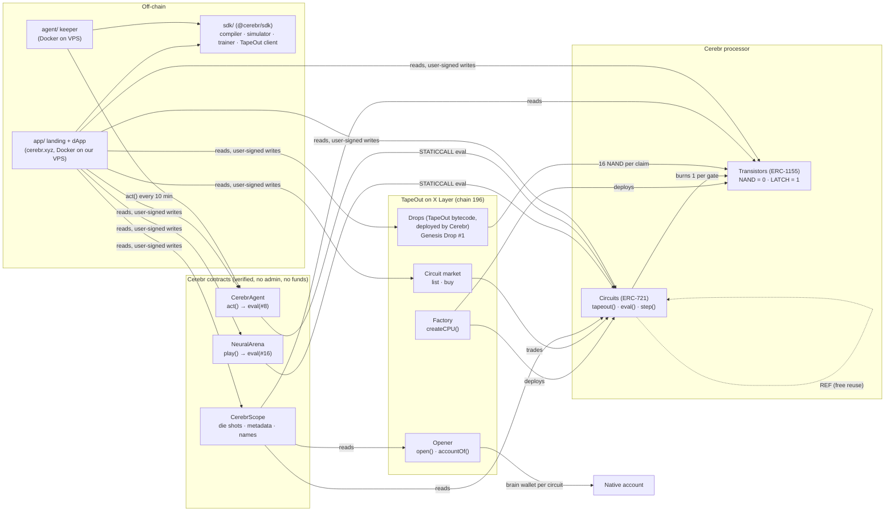

| Component | What it does |
|---|---|
| [`sdk/src/neuro`](sdk/src/neuro) | The neural compiler: netlist builder, NAND-optimal gate library, neuron constructions, the trainer, the Arena and Agent models, the catalog and a simulator that matches TapeOut's own client byte for byte. |
| [`sdk/src/tapeout`](sdk/src/tapeout) | A typed viem client for the factory, transistors, circuits, opener, accounts, drops and market: fees, quotes, reads and writes. |
| [`src/scope/CerebrScope.sol`](src/scope/CerebrScope.sol) | A lens over any TapeOut processor: batch views, gate mix parsed from netlist bytes, onchain SVG die shots and ERC-721 metadata, small truth tables, and a label registry only a circuit's owner can write. |
| [`src/arena/NeuralArena.sol`](src/arena/NeuralArena.sol) | Tic-tac-toe against circuit #16 with gas-capped onchain inference, fallback moves and inference receipts. |
| [`src/agent/CerebrAgent.sol`](src/agent/CerebrAgent.sol) | The autonomous agent: input derivation, gas-capped `eval()` of #8, ring buffer of decisions, replay. |
| [`agent/`](agent) | The keeper daemon with Docker, docker-compose and a hardened systemd unit. |
| [`sdk/scripts`](sdk/scripts) | The resumable, idempotent launch runbook, catalog labelling, fork rehearsals for the drop and market, and the arena netlist builder. |
| [`app/`](app) | The landing page (`/`) and the dApp (`/app`): Vite, React 19, wagmi and viem, using the SDK from source. |
| [`deploy/`](deploy) | Self-hosting for [cerebr.xyz](https://cerebr.xyz): a two-stage image (build, then nginx with a strict CSP), a loopback-only compose service and the host nginx site with Let's Encrypt HTTPS. |

## Asset issuance

Cerebr has no token of its own. **The asset is the Cerebr processor's transistor.**

| Term | Value |
|---|---|
| Supply cap | **1,000,000** transistors (NAND and LATCH share it) |
| Unit price | **0.00001 OKB** per transistor, paid to the processor's creator |
| TapeOut fees | 0.00066 OKB per mint call, 0.0013 OKB per tape-out, 0.08 OKB to open a brain wallet (read live by the app; TapeOut can change them) |
| Fixed at | `createCPU`, recorded in the `CPUCreated` event; Cerebr cannot change them |

Why these terms: a neural circuit uses many gates, so cheap gates keep a community neuron at a fraction of a cent in transistors (a 150-gate network is about 0.0015 OKB plus fees), while a 1,000,000 cap leaves room for thousands of circuits. Burns never free room under the cap, so transistors only get scarcer with use, and `REF` makes reusing a taped-out neuron free.

**Genesis Drop.** Drop #1 was funded with 400 NAND on an ownerless instance of TapeOut's drops contract, deployed by Cerebr from TapeOut's published bytecode: 16 per address, one claim each, enough for a first neuron. It moves transistors to new builders through a capped, transparent onchain drop instead of trades. At time of writing (block 72,529,688) it has **1 claim and 384 NAND remaining**. That claim is a Cerebr team wallet, [`0xcd0a…3c02`](https://www.okx.com/web3/explorer/xlayer/address/0xcd0a2370f2dc12c1802707b7d9ab3fec891e3c02), testing the claim flow on mainnet in [0x4d18…2db6](https://www.okx.com/web3/explorer/xlayer/tx/0x4d186077dfab5eb3f5c25e0876d549ef9367ac1ac385105939928cde91ec2db6) (block 72,527,608), disclosed here; the other 24 claims are open to the public.

**Disclosed creator activity** (no trades; the creator's only transfer is the 400-NAND Genesis Drop deposit; every mint a primary mint at the public price):

- Launch: 1,139 NAND + 102 LATCH minted; 141 burned into the 14 catalog circuits; the unit price came back to the creator through `withdraw()`.
- 2026-10-06 real-wallet test of the live app: 10 NAND minted and 16 burned into circuit #15, later renamed "Vote-with-veto neuron" onchain ([0x2778…099a](https://www.okx.com/web3/explorer/xlayer/tx/0x277868e6de15edc615d8dd963074018fb559470e15d27daac193089f17f8099a)).
- 2026-10-06: 590 NAND burned into circuit #16 (the NeuralArena bot); the drops contract deployed ([0xd0f4…8e02](https://www.okx.com/web3/explorer/xlayer/tx/0xd0f4367fc525a3500658953c334adafbe490b16040e71cdbab6f8ad3bfcb8e02)) and 400 NAND deposited into the Genesis Drop ([0x2d7c…8f20](https://www.okx.com/web3/explorer/xlayer/tx/0x2d7c052914b7e7a441b721ed025ce7e9bf832fb9804b85b885e6160ab1598f20)).
- The deployment wallet holds the rest: **4 NAND and 100 LATCH** at time of writing (747 burned in total, 400 deposited in the drop).

No self-trading and no wash trading: Cerebr's wallets never buy on the marketplace, and the app enforces it. Full design, alternatives and the cost of every circuit: [ISSUANCE.md](ISSUANCE.md).

## Design and user experience

- **A chip datasheet as a design system.** Geist, Geist Mono and Instrument Serif, a lime accent on near-black or paper, section rules and spec tables. Custom line icons for each app view (a die, a NAND gate, a pixel grid, a signal pulse, a game board, stacked dies, a neuron), drawn in the same vocabulary.
- **Live, never mocked.** Every number on the landing page and in the app comes from X Layer at runtime: issuance terms, fees, circuit counts, gate costs, the XOR truth table, the spiking-neuron timing diagram, Arena stats and the agent's decisions.
- **Two languages, end to end.** English and 简体中文, with typed dictionaries per feature and a check (`npm run i18n:check`) that fails the build on any untranslated string.
- **Two themes.** Dark and light, switched instantly with no flash, including theme-specific brand marks.
- **Wallets for desktop and mobile.** OKX Wallet first, any EIP-6963 wallet detected, and on a phone without an injected wallet, deep links that open Cerebr inside the OKX Wallet or MetaMask app. The app adds X Layer to a wallet that does not know it yet.
- **Safe writes.** Every transaction is simulated first, fees are read fresh before each quote, double clicks cannot send twice, errors from TapeOut contracts are translated into plain language, and a seed-phrase warning sits in the wallet picker.
- **Motion with purpose.** Scroll-driven reveals on the landing page, a live schematic of the processor, and a gate-level animation of inference; all of it respects reduced-motion settings.
- **Responsive.** Checked at 1440, 390 and 360 px with no horizontal scroll.

## Verification and security

| Check | Result |
|---|---|
| SDK tests (compiler, simulator, trainer, arena, agent, TapeOut client, launch guards) | 90 / 90 pass (`cd sdk && npm test`) |
| Foundry tests (CerebrScope, NeuralArena, CerebrAgent) | 43 unit and fuzz tests pass; fork suites against the real TapeOut contracts run with a fork RPC |
| Simulator vs TapeOut | byte-identical to TapeOut's own client; 160 random netlists taped out on a fork, 1,920 `eval`/`step` comparisons, 0 mismatches ([AUDIT.md](AUDIT.md)) |
| Neuron compiler | 331,370 exhaustive cases against the reference model, 0 mismatches |
| Arena bot | all 19,683 boards against an independent reference; full game tree: 0 human wins |
| Agent | constructor smoke test on all 32 inputs; fork e2e of the keeper; every live decision re-verified offline and in the app |
| Mainnet | every catalog netlist byte-identical to a fresh compile; onchain input cases match the simulator; #14 checked with `step()` |
| Contract source | CerebrScope, NeuralArena and CerebrAgent verified on Sourcify (exact match) |
| dApp | every feature run end to end on a mainnet fork as a fresh user (claim, tape-out, train, arena games, list and buy), plus a real-wallet test on mainnet |

Security properties of our contracts:

- No admin, no owner, no upgradeability, no payable functions, no custody of user funds.
- Inference into other contracts is always a gas-capped `STATICCALL` with strict return decoding; a failing or malicious circuit cannot block a game or the agent.
- Rate limits and immutable configuration on CerebrAgent; deterministic fallbacks on NeuralArena.
- Keys are never in the repo, never printed, and the keeper's hot wallet holds only gas money.

Internal review rounds are recorded in [AUDIT.md](AUDIT.md) with every finding and its resolution. This is an internal review, not a professional third-party audit.

## Build log

| Date | Milestone |
|---|---|
| 2026-10-04 | TapeOut integration verified on a mainnet fork and written up as [TAPEOUT.md](TAPEOUT.md); neural compiler, simulator and SDK; first integration review |
| 2026-10-05 | **Mainnet launch**: `createCPU`, the 14-circuit catalog taped out and verified onchain, a brain wallet opened, CerebrScope deployed and verified; full audit round |
| 2026-10-06 | Onchain names for the catalog; real-wallet test through the live app (#15); the dApp and landing page redesigned as a chip datasheet; English and 简体中文; dark and light themes; mobile wallet deep links |
| 2026-10-06 | **NeuralArena**: bot circuit #16 taped out, arena deployed and verified; **Genesis Drop** of 400 NAND; Train, Arena, marketplace and gate animation added to the app, each tested end to end on a fork |
| 2026-10-06 | **CerebrAgent** deployed and verified; keeper installed on our VPS in dry-run, then live; first autonomous decision; Agent tab with live replay |

## Quickstart

Requirements: [Foundry](https://book.getfoundry.sh), Node 26 (Node 23.6+ runs the TypeScript sources natively).

```bash
git clone --recurse-submodules https://github.com/NetLayerLabs/Cerebr.git
cd Cerebr

# SDK: compiler, simulator, trainer + TapeOut client
cd sdk && npm install && npm test && cd ..

# Contracts: CerebrScope, NeuralArena, CerebrAgent (fork suites are skipped without a fork RPC)
forge build && forge test

# The app (landing at /, dApp at /app), against X Layer mainnet
cd app && npm install && npm run dev
```

Rehearse on a local copy of X Layer mainnet, with nothing broadcast:

```bash
anvil --fork-url https://rpc.xlayer.tech --chain-id 196 --auto-impersonate --port 8545 &
SCOPE_FORK_RPC=http://127.0.0.1:8545 forge test           # CerebrScope against the real TapeOut contracts
cd sdk
FORK_RPC=http://127.0.0.1:8545 node scripts/fork-smoke.ts  # every TapeOut fact the project relies on
node scripts/launch.ts --dry-run                           # the launch plan and its exact OKB cost
```

Verify the agent yourself, from any machine:

```bash
RPC=https://rpc.xlayer.tech
AGENT=0x3d736c6419dCa667a351907578b68717Cd6e3340
cast call $AGENT "stats()" --rpc-url $RPC                                   # decisions, Go, No-Go, Abstain
cast call $AGENT "replay(uint256)(uint8,bool)" 1 --rpc-url $RPC             # re-run decision #1 onchain
cast call 0xB04EB79D1A5EECaabAAfF7B77d7c27578EE693FF "eval(uint256,bytes)(bytes)" 8 0x07 --rpc-url $RPC   # 0x01 = Go
```

Running the keeper on your own server is documented step by step in [agent/README.md](agent/README.md); going live with a processor is in [LAUNCH.md](LAUNCH.md).

## Using the SDK

```ts
import { createPublicClient, http } from 'viem'
import { getCircuit, encodeHex, neuron, tapeout } from '@cerebr/sdk'

const CEREBR = '0xB04EB79D1A5EECaabAAfF7B77d7c27578EE693FF'
const client = createPublicClient({ chain: tapeout.xLayer, transport: http('https://rpc.xlayer.tech') })

// Run the REF-composed XOR network (#5) onchain: x0 = 1, x1 = 0
const [y] = await tapeout.evalCircuit(client, { circuits: CEREBR, id: 5n, inputs: [1, 0] }) // → 1

// Compile your own threshold neuron and inspect its cost
const nl = getCircuit('xor-net').build({ mode: 'direct' })
console.log(nl.counts) // { nand: 6, latch: 0, ref: 0, ... }
console.log(encodeHex(nl))

// Read the processor's live state and fees
const cpu = await tapeout.readCpu(client, CEREBR)
const fees = await tapeout.readFees(client, { circuits: CEREBR })
```

The exact function signatures are in [`sdk/src/tapeout/client.ts`](sdk/src/tapeout/client.ts) and [`sdk/src/neuro/index.ts`](sdk/src/neuro/index.ts); every TapeOut behaviour they rely on is documented in [TAPEOUT.md](TAPEOUT.md).

## Repository layout

```
sdk/src/neuro/       neural compiler, simulator, trainer, arena and agent models, catalog
sdk/src/tapeout/     TapeOut client: addresses, ABIs, encoding and quotes, drops, market, reads and writes
sdk/scripts/         launch runbook, catalog labels, fork rehearsals (smoke, drop, market), arena netlist
sdk/test/            SDK tests
src/scope/           CerebrScope (lens, die-shot SVG, metadata, labels)
src/arena/           NeuralArena (tic-tac-toe against circuit #16)
src/agent/           CerebrAgent (autonomous agent whose policy is circuit #8)
script/              DeployScope.s.sol, DeployArena.s.sol, DeployAgent.s.sol
test/                scope/, arena/, agent/: unit, fuzz and fork tests
agent/               CerebrAgent keeper daemon (Docker, docker-compose, systemd)
launch/              config.json (identity and issuance terms), out/ and state (mainnet launch records)
app/                 landing page and dApp (Vite, React, wagmi, viem)
deploy/              self-hosting for cerebr.xyz (Dockerfile, nginx, compose, install.sh)
media/               screenshots used in this README
```

## Documentation

| Document | Contents |
|---|---|
| [SUBMISSION.md](SUBMISSION.md) | The hackathon submission and demo script |
| [TAPEOUT.md](TAPEOUT.md) | The TapeOut integration spec as verified on a mainnet fork: addresses, fees, netlist format, REF rules, drops, market, costs and error strings |
| [AGENT.md](AGENT.md) | CerebrAgent: design, input mapping, safety, costs, verification and its mainnet record |
| [agent/README.md](agent/README.md) | Running the keeper on a VPS: Docker or systemd, dry run, monitoring, stopping |
| [ARENA.md](ARENA.md) | NeuralArena: the 590-NAND bot circuit #16, its checks and its mainnet record |
| [ISSUANCE.md](ISSUANCE.md) | Transistor issuance design, alternatives, the cost of each circuit, fee flows and the anti-wash-trading stance |
| [LAUNCH.md](LAUNCH.md) | The mainnet launch runbook, checklist and the full launch record |
| [AUDIT.md](AUDIT.md) | The internal security review and its findings |
| [app/README.md](app/README.md) | Running, building and deploying the app |

## Risks

TapeOut's X Layer contracts are in a test phase: they are upgradeable and unaudited, and their owner can change code and fees. Cerebr holds no user funds; mints, tape-outs, claims, trades and wallet openings are direct calls to TapeOut's contracts. CerebrScope, NeuralArena and CerebrAgent have no payable functions and no admin. Circuits run as view calls with gas limits, so onchain networks stay small, from tens to hundreds of gates. The agent's signal is a public demonstration of verifiable onchain inference, not trading advice. Nothing here is investment advice.

## License

[MIT](LICENSE) · Built by NetLayer Labs
