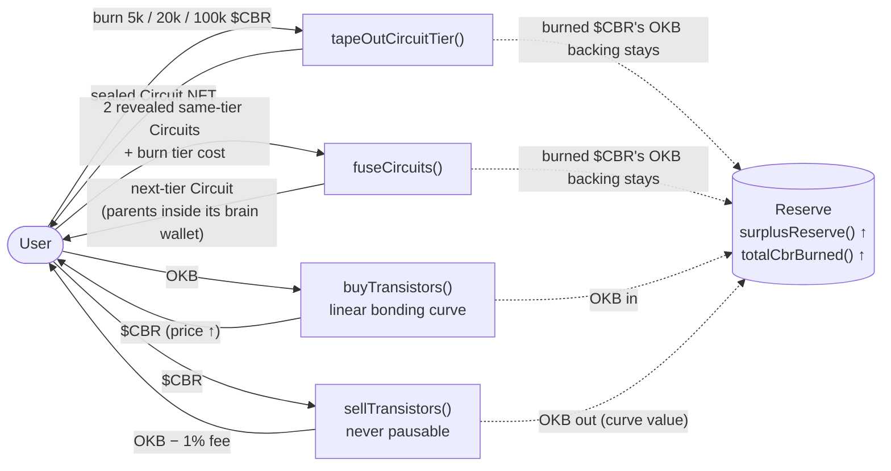
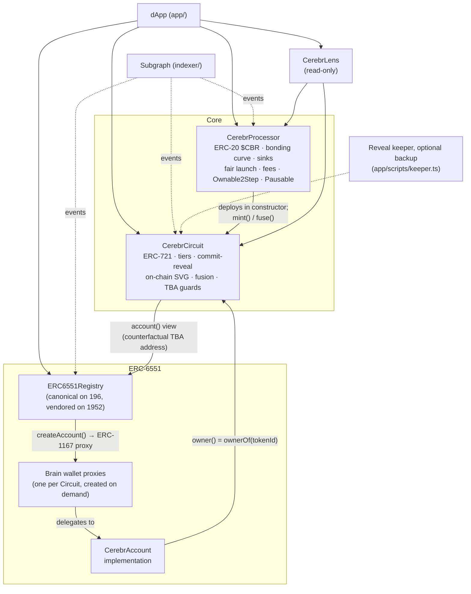

# Cerebr

**Mint compute. Burn it into AI brains. Every burn makes the reserve stronger.**

Cerebr is an on-chain "chip fab" on **X Layer**. Users buy **Transistors ($CBR)** from a bonding curve backed by native OKB, then *tape out* **Neural Circuits**: ERC-721 AI brains with fully on-chain SVG art, four tiers and commit-reveal traits. Two Circuits can be *fused* into a higher tier. Every Circuit owns an **ERC-6551 brain wallet**, and fused parents live inside their child's wallet. Every tape-out and fusion burns $CBR, while the OKB that paid for those tokens stays locked in the Processor for good. The result is that the curve gets more over-collateralised with every burn, and anyone can check this on-chain.

Built for the IGNIX X Layer TapeOut hackathon.

## The economic loop



- **Price** is `BASE_PRICE + SLOPE · supply`. Buys round up and sells round down, so `balance ≥ reserveRequired() + protocolFees` always holds.
- **Sinks.** Basic costs 5k CBR, Pro 20k and Quantum 100k. A fusion burns the cost of the input tier. Singularity can only be reached by fusion.
- **Surplus.** `surplusReserve()` is OKB that nobody can withdraw, not even the owner. It grows with each burn. A burn lowers the spot price but over-collateralises everything that is left. The full model is in [TOKENOMICS.md](TOKENOMICS.md).

## Features

| # | Feature | Where |
|---|---|---|
| 1 | **Tiers.** Basic, Pro, Quantum and fusion-only Singularity. Higher tiers get better rarity odds and trait ranges. `tapeOutCircuit()` makes a Basic; `tapeOutCircuitTier(tier)` makes any mintable tier. | `CerebrProcessor`, `CerebrCircuit` |
| 2 | **Fusion.** Two revealed Circuits of the same tier plus the tier's CBR cost make one Circuit of the next tier. The parents move into the child's ERC-6551 wallet. Each Circuit can be a fusion parent only once. | `fuseCircuits`, `fusedInto` |
| 3 | **Commit-reveal traits with on-chain auto-reveal.** The seed is the hash of the block after the mint, so reverting a transaction can't re-roll it. A FIFO reveal queue settles ready Circuits inside every tape-out and fusion (up to 2) and buy (up to 1), so owners can't wait out the hash window while the protocol is in use. Anyone can also reveal; an expired hash re-commits instead of using zero. Unrevealed Circuits show a sealed-wafer SVG. | `reveal`, `processRevealQueue`, `revealQueueHead`, `tokenURI` |
| 4 | **Fair-launch guard.** Net buys are capped per wallet and per block for the first N blocks. Sells are never capped. | `launchActive`, `launchCapRemaining` |
| 5 | **Live deflation counters:** `surplusReserve()`, `totalCbrBurned()`, `mintedByTier()` | Processor / Circuit |
| 6 | **ERC-6551 brain wallets.** A minimal account (CALL only, ERC-1271, ERC-721/1155 receiver, `state` counter) works with the canonical registry on mainnet and a vendored registry on testnet. Wallets are created lazily, never at mint. The Circuit contract blocks ownership cycles and operator pulls out of a wallet. | `src/erc6551/` |
| 7 | **Lens.** One-call views for the dApp: an exact `quoteBuyExactOKB`, protocol and user snapshots, and curve points for charts. | `CerebrLens` |
| 8 | **Subgraph.** Indexes every Processor, Circuit and registry event (trades, tape-outs, fusions, reveals, wallets, daily snapshots). | [indexer/](indexer/README.md) |
| 9 | **dApp.** Vite, React, viem and wagmi. OKX Wallet is listed first. It has a live curve chart, buy/sell with slippage, tape-out per tier, a fusion picker, reveal, a gallery and brain wallets. | [app/](app/README.md) |
| 10 | **Security review.** Two rounds of multi-agent audits plus the round-3 auto-reveal fix, 219 tests, 15 stateful invariants (plus a liveness suite) and 98% line coverage. | [AUDIT.md](AUDIT.md) |

## Architecture



- **`CerebrProcessor`** is the only minter of $CBR and of Circuits. It holds every OKB.
  - The owner can pause buys, tape-outs and fusions, and can withdraw the 1% sell fees.
  - The owner cannot reach the reserve, pause sells, change parameters or renounce ownership.
- **`CerebrCircuit`** stores each Circuit in one packed slot: tier, revealed flag and commit block.
  - A FIFO auto-reveal queue (one cursor packed with `totalMinted`) reveals ready Circuits during `mint`, `fuse` and buys, strictly bounded and never reverting.
  - It keeps the reverse lookup `tokenOfAccount` (TBA → Circuit) and `fusedInto`.
  - On every transfer it walks up to 16 TBA hops to block ownership cycles.
  - It refuses to let an operator move a Circuit out of a Circuit TBA.
- **`CerebrAccount`** is controlled by whoever owns the NFT. Nesting works: the owner of a child Circuit controls the parents' wallets through nested `execute` calls.
- **`CerebrLens`** is a stateless view helper. The dApp only needs the Lens address; it reads every other address from `protocolState()`.

## Quickstart

Requirements: [Foundry](https://book.getfoundry.sh/), and Node ≥ 23.6 for the dApp scripts.

```bash
git clone <this repo> && cd Cerebr
forge build
forge test                       # 219 tests: unit, fuzz (1,000 runs), 2 × 15 stateful invariants + liveness suite
forge test --gas-report
forge coverage --report summary
```

**Local end-to-end demo** (anvil, nothing public):

```bash
app/scripts/local-demo.sh 8545          # anvil + deploy + seeded Circuits + fusion + ABIs + addresses
cd app && npm install
VITE_RPC_31337=http://127.0.0.1:8545 VITE_DEFAULT_CHAIN_ID=31337 VITE_ANVIL_AUTOCONNECT=true npm run dev
RPC_URL=http://127.0.0.1:8545 npm run smoke     # 33 on-chain checks through the dApp's own config
RPC_URL=http://127.0.0.1:8545 npm run keeper    # optional reveal keeper (backup for quiet periods)
```

**Indexer:** `cd indexer && npm install && npm run codegen && npm run build`. See [indexer/README.md](indexer/README.md).

**Deploy to X Layer:** see [DEPLOY.md](DEPLOY.md). It covers the testnet → mainnet flow, registry handling, OKLink verification and the recommended fair-launch parameters.

## Deployments

| Contract | X Layer testnet (1952) | X Layer mainnet (196) |
|---|---|---|
| CerebrProcessor ($CBR) | _TBD_ | _TBD_ |
| CerebrCircuit (NFT) | _TBD_ | _TBD_ |
| CerebrLens | _TBD_ | _TBD_ |
| CerebrAccount (implementation) | _TBD_ | _TBD_ |
| ERC6551Registry | _TBD_ (vendored) | `0x000000006551c19487814612e58FE06813775758` (canonical) |
| dApp / Subgraph | _TBD_ | _TBD_ |

## Repository layout

```
src/                 CerebrProcessor, CerebrCircuit, CerebrLens, erc6551/{CerebrAccount, ERC6551Registry, interfaces}
test/                unit, fuzz, features, ERC-6551, Lens and invariant suites
script/              Deploy.s.sol (X Layer), LocalDemo.s.sol (anvil only)
app/                 dApp, smoke test, optional reveal keeper
indexer/             subgraph (schema, mappings, networks)
deployments/         <chainId>.json written by the deploy script
```

## Documentation

- [TOKENOMICS.md](TOKENOMICS.md): curve, sinks, tiers, fusion, fair launch, surplus
- [AUDIT.md](AUDIT.md): scope, methodology, both audit rounds, invariants, coverage, gas, risks
- [DEPLOY.md](DEPLOY.md): testnet → mainnet, verification, parameters, checklist
- [app/README.md](app/README.md): dApp, smoke test, optional keeper
- [indexer/README.md](indexer/README.md): subgraph entities, deploy, example queries

## Open decisions

1. **Fusion versus direct tape-out pricing.** Fusion reaches Pro for 15k CBR (direct: 20k) and Quantum for 50k (direct: 100k). Should direct prices be lowered, should fusion cost more, or should this stay as a convenience premium? (AUDIT 2-4)
2. **Final launch parameters and curve parameters** for mainnet (see DEPLOY.md).

Resolved: **on-chain auto-reveal** (AUDIT 2-6) is implemented. Tape-outs and fusions reveal up to 2 queued Circuits and buys reveal 1, at about +31k gas per mint in steady state. The keeper is now an optional backup.

## License

MIT
